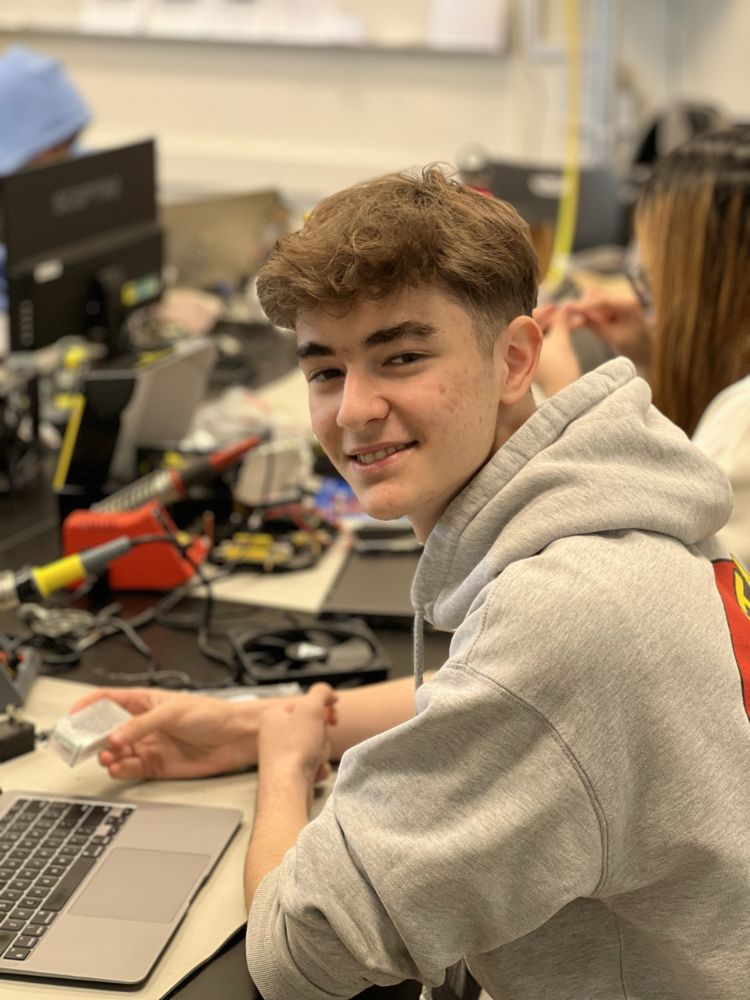
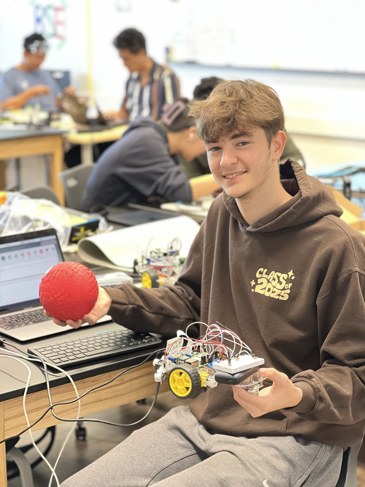
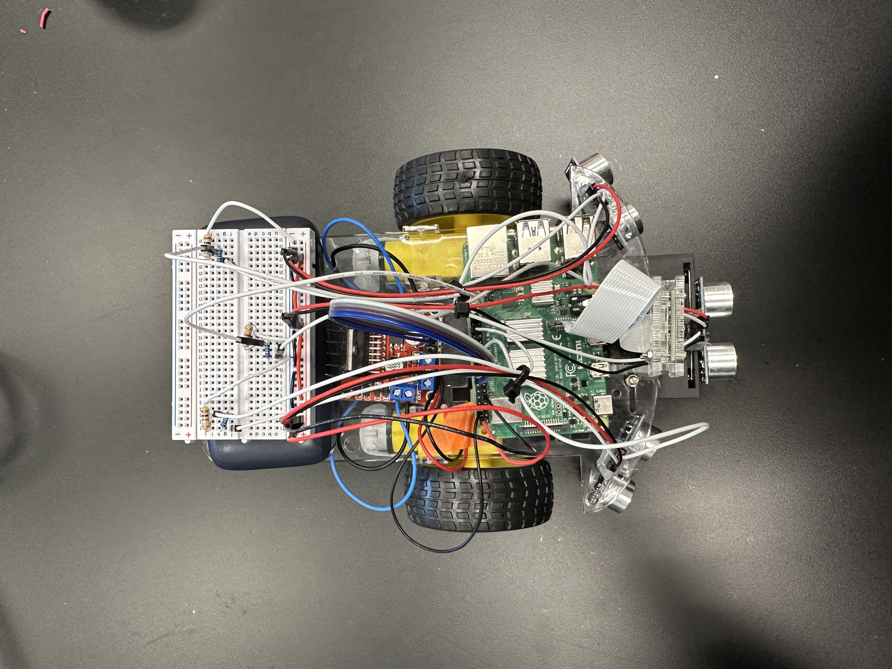

# Ball Tracking Robot with OpenCV and Computer Vision  
<!---
Replace this text with a brief description (2-3 sentences) of your project. This description should draw the reader in and make them interested in what you've built. You can include what the biggest challenges, takeaways, and triumphs from completing the project were. As you complete your portfolio, remember your audience is less familiar than you are with all that your project entails!
-->

| **Engineer** | **School** | **Area of Interest** | **Grade** |
|:--:|:--:|:--:|:--:|
| Derin G | Cupertino HS | General Engineering, Undecided | Rising Junior

{:height="49%" width="49%"}
{:height="49%" width="49%"}


<!--
# Final Milestone

For your final milestone, explain the outcome of your project. Key details to include are:
- What you've accomplished since your previous milestone
- What your biggest challenges and triumphs were at BSE
- A summary of key topics you learned about
- What you hope to learn in the future after everything you've learned at BSE

**Don't forget to replace the text below with the embedding for your milestone video. Go to Youtube, click Share -> Embed, and copy and paste the code to replace what's below.**

<iframe width="560" height="315" src="https://www.youtube.com/embed/F7M7imOVGug" title="YouTube video player" frameborder="0" allow="accelerometer; autoplay; clipboard-write; encrypted-media; gyroscope; picture-in-picture; web-share" allowfullscreen></iframe>
-->

# Second Milestone

<iframe width="560" height="315" src="https://www.youtube.com/embed/6yCgNUtyPdY" title="YouTube video player" frameborder="0" allow="accelerometer; autoplay; clipboard-write; encrypted-media; gyroscope; picture-in-picture; web-share" allowfullscreen></iframe>


## Summary

This milestone was the main part of my project. I completed several major tasks, including writing the color detection, ball identification, ultrasonic sensor sensitivity, and robot movement codes. Throughout this milestone, I also worked on lots of wire management, and got a general idea of how I want my final product to look in terms of its organization.

### Components Used
**New** components used after the first milestone include:

- Raspberyy Pi Camera
    - Once connected to the CAMERA port of the Raspberry Pi board, this camera can be used to take live video capture or take images onto the Raspberry Pi minicomputer. This component is extremely useful for my project because it is essential for the main function of the robot, which is color detection, making it ultimately able to track the red ball.
- Basic assembly and wiring components:
    - Jumper wires
    - Resistors for ultrasonic sensor voltage divider
    - Hot glue
    - Electrical tape

## Challenges 

This milestone came with many challenges, the main ones including wire management, understanding and creating voltage dividers for my ultrasonic sensor, and especially color detection with OpenCV. Upon completion of my second milestone, my wires are relatively organized, my voltage divider works perfectly as to not burn out my Raspberry Pi board by sending in less voltage to the pins, and my color detection and linear movement code works nearly flawlessly. 

### Color Detection with OpenCV:

{:height="270" width="480"}

## What's Next? 

When finalizing the last parts to my project, I plan on implementing **object detection** on top of color detection and taking a user input to follow a variety of different objects, not just a red ball. Finally, I plan on organizing my robot even better and improving my wire management. 

# First Milestone

<iframe width="560" height="315" src="https://www.youtube.com/embed/gQoetvs1tU4" title="YouTube video player" frameborder="0" allow="accelerometer; autoplay; clipboard-write; encrypted-media; gyroscope; picture-in-picture; web-share" allowfullscreen></iframe>

## Summary 

The end goal for my project is for the camera to be able to detect the red ball and for the robot to be able to maneuver accordingly to follow the ball through my Python code. Up until this first milestone, I've built the starting prototype of my robot, set up my Raspberry Pi micro-controller, wired my two motors to my L298N motor driver board and to a power source (6V battery pack), and wrote some simple lines of code to test the functionality of both my Raspberry Pi camera and DC motors (wheels). 

### Components Used

- Raspberry Pi micro-processor
    - The component that provides the main function of the project. The Raspberry Pi is essentially a minicomputer that you can write code onto, and ultimately power the robot through wiring. 
- DC motors
    - A type of motor which is commonly used to provide functionality to wheels. This motor works by making use of an electromagnet which constantly switches its polarity by switching the direction of the current. This current direction switch is made possible with the commutator and brushes of the motor, which allows for the motor to constantly spin. 
- Ultrasonic sensors
    - These extremely useful devices work by sending out an ultrasound from the transmittor (trigger pin) and receiving it from the receiver (echo pin). By using some simple calculations including the speed of sound and dividing the final distance by 2 to account for both distances traveled, the ultrasonic sensor is very useful in applications such as this robot.
- L298N motor driver board
    - A dual H-Bridge motor driver board which makes use of a multitude of transistors, allowing for this device to control the direction and speed of two different motors, making it a very useful addition for a project such as this robot. 

## Challenges

Some of the most challenging obstacles I faced was figuring out how work and display my Raspberry Pi, and to troubleshoot with one of my motors, which was originally not working. I've managed to overcome both of these major challenges so far, and now have a functioning Raspberry Pi and two functioning DC motors. Additional challenges that I have yet to overcome include the installation of the 3 ultrasonic sensors and the trainnig of the machine learning model meant to track the color red with computer vision.

In the future, I plan to research how to overcome the challenge of building a machine learning model and figuring out how to wire my ultrasonic sensors by studying past circuit diagrams and getting a fundamental understanding of how an ultrasonic sensor works.  

# Schematics 

{:height="33%" width="31%"}
{:height="33%" width="31%"}
{:height="33%" width="31%"}
# Code
<!---
Here's where you'll put your code. The syntax below places it into a block of code. Follow the guide [here]([url](https://www.markdownguide.org/extended-syntax/)) to learn how to customize it to your project needs. 

```c++
void setup() {
  // put your setup code here, to run once:
  Serial.begin(9600);
  Serial.println("Hello World!");
}

void loop() {
  // put your main code here, to run repeatedly:

}
```


# Bill of Materials
<!--
Here's where you'll list the parts in your project. To add more rows, just copy and paste the example rows below.
Don't forget to place the link of where to buy each component inside the quotation marks in the corresponding row after href =. Follow the guide [here]([url](https://www.markdownguide.org/extended-syntax/)) to learn how to customize this to your project needs. 

| **Part** | **Note** | **Price** | **Link** |
|:--:|:--:|:--:|:--:|
| Item Name | What the item is used for | $Price | <a href="https://www.amazon.com/Arduino-A000066-ARDUINO-UNO-R3/dp/B008GRTSV6/"> Link </a> |
|:--:|:--:|:--:|:--:|
| Item Name | What the item is used for | $Price | <a href="https://www.amazon.com/Arduino-A000066-ARDUINO-UNO-R3/dp/B008GRTSV6/"> Link </a> |
|:--:|:--:|:--:|:--:|
| Item Name | What the item is used for | $Price | <a href="https://www.amazon.com/Arduino-A000066-ARDUINO-UNO-R3/dp/B008GRTSV6/"> Link </a> |
|:--:|:--:|:--:|:--:|

# Other Resources/Examples
<!---
One of the best parts about Github is that you can view how other people set up their own work. Here are some past BSE portfolios that are awesome examples. You can view how they set up their portfolio, and you can view their index.md files to understand how they implemented different portfolio components.
- [Example 1](https://trashytuber.github.io/YimingJiaBlueStamp/)
- [Example 2](https://sviatil0.github.io/Sviatoslav_BSE/)
- [Example 3](https://arneshkumar.github.io/arneshbluestamp/)
-->

# Starter Project

<iframe width="560" height="315" src="https://www.youtube.com/embed/G0spfXQhkr8" title="YouTube video player" frameborder="0" allow="accelerometer; autoplay; clipboard-write; encrypted-media; gyroscope; picture-in-picture; web-share" allowfullscreen></iframe>

## Summary
As a starter project, I chose to make a digital clock. This project makes use of a variety of different components which all work together to provide the time display that you see as an end result. The main conceptual understanding of how a digital clock works comes with understanding the **time base**, which is essentially the internal clock of the digital clock, providing the project with functionality. The component that makes this internal clock possible is the **crystal oscillator**, one of the most important components of a digital clock. 

### Components Used
- Resistors: a component that resists the flow of electricity
- Thermistors: thermally sensitive resistor 
- Photoresistors: light-sensitive resistor
- Transistors: a device that regulates electricity flow and can act as a switch
- Capacitors: a component that temporarily stores electrical energy and creates a potential difference
- Diode: a device that directs current by not allowing it to travel in the reverse direction
- **A crystal oscillator** 
- A lithium battery
- Buzzer
- DIP-20 IC: an integrated circuit
- DIP-8 IC: an integrated circuit

The function of a digital clock revolves around a quartz crystal inside which oscillates, and therefore is named the crystal oscillator. Quartz is the ideal material to use as these oscillators due to the uniformity in its structure at the molecular level, which ultimately resutls in more consistent oscillations (or vibrations), bettering the time base as opposed to how it would be using a different material. When the electric charge (coming from the power source) reaches this crystal, it begins to oscillate at a frequency of approximately 33,000 oscillations per second (Hz). For each 33,000 oscillations of the crystal (or one second of real time), the circuit releases an electric pulse, effectively converting the oscillations of the crystal into seconds. 

The clock must then convert this internal count of time into the digital display you see on the surface. For every time the clock's oscillations are counted and an electric pulse is released, the electric pulse is converted to binary, which is then understood by the microchip (DIP IC) which converts the binary to a measure of time (hours, minutes, seconds). Finally, another microchip reads the binary numbers received then lights up the appropriate section on the LED display, completing the function of the clock. 

### Challenges Faced
However, despite the seemingly smooth processs, this project did come with many challenges. With a digital clock generally being fairly small, this makes the soldering work very precise and difficult. I had to come up with unorthodox ways of soldering my components onto the board with the little amount of space I had to work with. This project also came with soldering parts that you wouldn't usually see in any other electronics project. My digital clock came with having to solder the lithium battery pack onto a flat surface, which is one of the many unusual uses of solder that I had to navigate through this project. 
