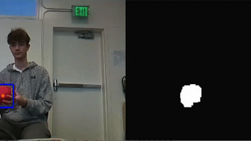
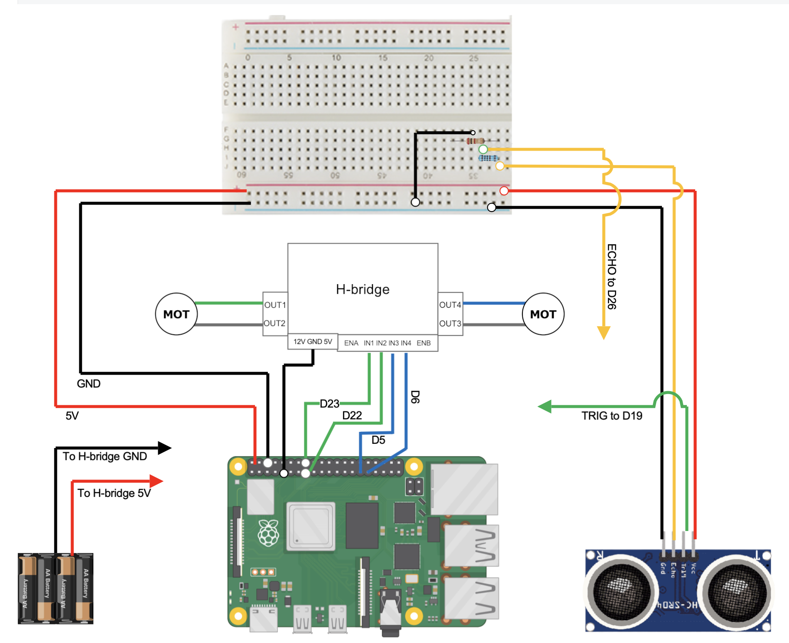
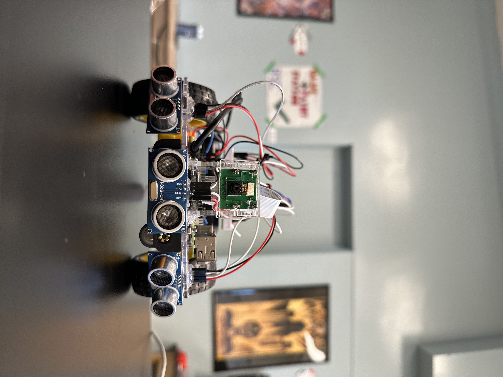
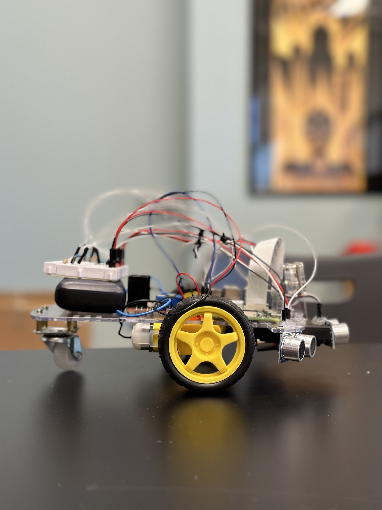
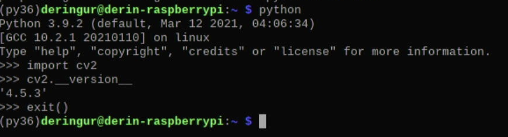

# Ball Tracking Robot with OpenCV: Computer Vision  

This project is a ball tracking robot using computer vision techniques using a well-known Python library, **OpenCV**. This project includes many different components, all of which provide a unique functionality to the final product; the robot features the Raspberry Pi minicomputer, a PiCamera (used for color detection), DC motors to control the wheels, and ultrasonic sensors to reduce the possibility of a collision. 


| **Engineer** | **School** | **Area of Interest** | **Grade** |
|:--:|:--:|:--:|:--:|
| Derin G | Cupertino HS | Electrical Engineering | Rising Junior

&nbsp;

{:height="100%" width="100%"}

# Fourth Milestone

## Summary 

In my fourth milestone, I began to add much more complexity to the movement abilities of my robot while also adding LED features that light up depending on a certain state that the robot is in and cleaning up my code to optimizing the searching feature that the robot already had in the previous milestone. In addition to previous features, the ball tracking robot is now able to *maneuver around obstacles* that lie in the way of its path toward the ball, as well as *efficiently search for the ball* in case the ball rolls out of the frame. The robot now also features two *LEDs* on the back, both of which indicate different states that the robot is in. The <ins>red</ins> LED will light up when the robot is in the process of tracking the ball, while the <ins>green</ins> LED will light up when the robot has located the ball and has parked in front of it. 

<a id="FieldTests"></a>
### Final Robot Field Tests 

Here are field test videos from both human and robot's eye views. These may help to get a grasp of what's really happening in the software aspect of this project and what the robot sees compared to how we view the final product. 

***Human View:***
<iframe width="560" height="315" src="https://www.youtube.com/embed/gwY0bOhOlUM" title="YouTube video player" frameborder="0" allow="accelerometer; autoplay; clipboard-write; encrypted-media; gyroscope; picture-in-picture; web-share" allowfullscreen></iframe>

***Robot's View:***
<iframe width="560" height="315" src="https://www.youtube.com/embed/GpLTcZbEwbo" title="YouTube video player" frameborder="0" allow="accelerometer; autoplay; clipboard-write; encrypted-media; gyroscope; picture-in-picture; web-share" allowfullscreen></iframe>


## Challenges

The main challenges of this milestone were the *complex movement features* I decided to add. These movement features added a lot more complexity to the logic of my code, and as a result was hard to navigate through. Another main challenge I faced during this time was the frame rate drops I was experiencing. With some movement patterns, I had to incorporate the time.sleep() function in order to have more precise movements. However, since this robot works off live video capture, any time.sleep() functions would freeze my video capture for a short amount of time. These quick *drops in frames per second (FPS)* was enough to instead lower the precision and accuracy at which my robot would be able to track the ball, especially when the ball was in slight motion. In order to fix this problem, I had to find ways to decrease the time spent sleeping the live video capture in my code, and fine tune it to an equilibrium of smooth and precise tracking as well as movement efficiency. 

## Next Steps

One major problem I encountered and have yet to fix was the dilemma my robot would face in a very specific situation. If an object (obstacle) were to stand in front of the center ultrasonic sensor and the ball would be seen farther away, the robot would mark the ball as found, *confusing it with the object in front.* In the future, I would like to add some complexity to my code to be able to fix this, however, this oddly specific situation was not a problem I faced enough to the point where it was ruining the functionality of my project. Additionally, fixing a small error in logic like this would require a whole separate set of logic that would inevitably run across the same issue I had with the drops in frames per second, as mentioned above.

Another feature I plan on implementing in the feature is the use of the **enable pins** on the L298N motor driver board. These enable pins would allow me to control the speed at which the motors turn in specific situations, especially while turning, which would allow for *more efficient searching methods* for this robot, as it would limit overshooting while searching.

# Third Milestone

<iframe width="560" height="315" src="https://www.youtube.com/embed/BLc-4pT_r2o" title="YouTube video player" frameborder="0" allow="accelerometer; autoplay; clipboard-write; encrypted-media; gyroscope; picture-in-picture; web-share" allowfullscreen></iframe>

## Summary

In this third milestone, I worked on adding the second dimension to the movement of my robot, adding code to turn left and right depending on the positioning of the red ball. I also added a searching feature for the bot, meaning that if no large groups of red pixels are detected, the robot will go into search mode and make slow turns until it locates the red ball once again. Finally, in this milestone, I added a reverse feature which puts the robot in reverse if a foreign object is detected by the ultrasonic sensors. 

Some key concepts this project has taught me was the color detection implementation with OpenCV, and how useful this library truly is. Many of the functions in my final code are using OpenCV, and make the code much quicker and simpler to write. Additionally, this project taught me the concept of a voltage divider, a very important addition to certain circuits. Since this project uses the HC-SR04 Ultrasonic Sensor, a voltage divider must be used to reduce the voltage from *5V* to *3.3V* for the Raspberry Pi pins. 

## Challenges 

The main challenge I faced within this milestone had to do with the sizing of my frame. The frame spans from -70 to 240 (approximately) on the x-axis, which added confusion to some of my calculations and margins involving the robots second dimensional movements. Once I discovered the mistake, I was able to fix my calculations accordingly and therefore run my movement with much more accuracy. 

## What's Next? 

Being a fairly simple build in terms of hardware, this project has much more potential for future implementations of different features both physically, and in the world of software, one of which is **object detection**. This is an idea I would like to implement in the future, but struggled to do so in the scope of this project due to the speed at which the Raspberry Pi can operate with a complex neural network such as the ones that most of these object detection implementations use. Additionally, with this project, I used a 32-bit OS as opposed to a 64-bit OS, which is more capable in handling more data at once.

<a id="pseudocode"></a>
## Pseudo Code

<pre style="background:#fdfdfd; border:none; height:25pc">
if( area_of_red < 400 ):
	print( "This is not the ball" )
	Ball is not found 
else:
	Ball is found


if( Ball is found ):
	if( no_obstacle ):
		LED_SEARCH = on
		LED_FOUND = off

		if( center_x < 40 ):
			turn_left()
			ball_last_seen = LEFT

		elif( center_x > 280 ):
			turn_right()
			ball_last_seen = RIGHT

		elif( 40 < center_x < 280 ):
			forward()

			if( center_x < half of frame's width ):
				ball_last_seen = LEFT

			elif( center_x >= half of frame's width ):
				ball_last_seen = RIGHT
	 
	elif( obstacle ):
		stop()

		if(( center_distance < 10 cm ) and ( area_of_red >= 10000 )):
			stop()
			LED_SEARCH = off
			LED_FOUND = on
			*Robot parked, ball has been located*

		elif( left_distance < 17.5 cm ):
			move_back_left() for 0.2 seconds
			forward()

		elif( right_distance < 17.5 cm ): 
			move_back_right() for 0.2 seconds
			forward()

elif( Ball is not found ):
	LED_SEARCH = off

	if( no_obstacle ):
		if( ball_last_seen = left ):
			search_left() for 0.08 seconds
			stop()

		elif( ball_last_seen = right ):
			search_right() for 0.08 seconds
			stop()

	elif( obstacle ):
		reverse()

else:
	stop()


if( user_input == "q")
	stop()
	break the loop
            
</pre>

# Second Milestone

<iframe width="560" height="315" src="https://www.youtube.com/embed/6yCgNUtyPdY" title="YouTube video player" frameborder="0" allow="accelerometer; autoplay; clipboard-write; encrypted-media; gyroscope; picture-in-picture; web-share" allowfullscreen></iframe>


## Summary

This milestone was the main portion of my project's work, as I completed several major tasks, including writing the color detection, ball identification, ultrasonic sensor sensitivity, and linear robot movement codes. Throughout this milestone, I also worked on lots of wire management, and got a general idea of how I want my final product to look in terms of its organization.

### Components Used
**New** components used after the first milestone include:

- Raspberry Pi Camera
    - Once connected to the CAMERA port of the Raspberry Pi board, this camera can be used to take live video capture or take images onto the Raspberry Pi minicomputer. This component is extremely useful for my project because it is essential for the main function of the robot, which is color detection, making it ultimately able to track the red ball.
- Basic assembly and wiring components:
    - Jumper wires
    - Resistors for ultrasonic sensor voltage divider
    - Hot glue
    - Electrical tape

## Challenges 

This milestone came with many challenges, the main ones including wire management, understanding and creating voltage dividers for my ultrasonic sensor, and especially color detection with OpenCV. Upon completion of my second milestone, my wires are relatively organized, my voltage divider works perfectly as to not burn out my Raspberry Pi board by sending in less voltage to the pins, and my color detection and linear movement code works nearly flawlessly. 

{:height="405" width="720"}

## What's Next? 

When finalizing the last parts to my project, I plan on implementing **object detection** on top of color detection and taking a user input to follow a variety of different objects, not just a red ball. Finally, I plan on organizing my robot even better and improving my wire management. 

# First Milestone 

<iframe width="560" height="315" src="https://www.youtube.com/embed/gQoetvs1tU4" title="YouTube video player" frameborder="0" allow="accelerometer; autoplay; clipboard-write; encrypted-media; gyroscope; picture-in-picture; web-share" allowfullscreen></iframe>

## Summary 

The end goal for this robot is to be able to maneuver according to the largest area of red pixels seen by the PiCamera with Python code using the OpenCV library. Up until this first milestone, I've built the starting prototype of my robot, set up my Raspberry Pi minicomputer, wired my two motors to the L298N motor driver board (H-Bridge) and to a power source (6V battery pack), and finally wrote some simple lines of code to test the functionality of both my Raspberry Pi camera and DC motors (wheels). 

### Components Used

- Raspberry Pi minicomputer
    - The component that provides the main function of the project. The Raspberry Pi is essentially a minicomputer that you can write code onto, and ultimately power the robot through wiring. 
- DC motors
    - A type of motor which is commonly used to provide functionality to wheels. This motor works by making use of an electromagnet which constantly switches its polarity by switching the direction of the current. This current direction switch is made possible with the commutator and brushes of the motor, which allows for the motor to constantly spin. 
- Ultrasonic sensors
    - These extremely useful devices work by sending out an ultrasound from the transmittor (trigger pin) and receiving it from the receiver (echo pin). By using some simple calculations including the speed of sound and dividing the final distance by 2 to account for both distances traveled, the ultrasonic sensor is very useful in applications such as this.
- L298N motor driver board
    - A dual H-Bridge motor driver board which makes use of a multitude of transistors, allowing for this device to control the direction and speed of two different motors, making it a very useful addition for a project such as this. 

## Challenges

Some of the most challenging obstacles I faced was figuring out how work and display my Raspberry Pi, and to troubleshoot with one of my motors, which was originally not working. I've managed to overcome both of these major challenges so far, and now have a functioning Raspberry Pi and two functioning DC motors. Additional challenges that I have yet to overcome include the installation of the 3 ultrasonic sensors and the trainnig of the machine learning model meant to track the color red with computer vision.

In the future, I plan to research how to overcome the challenge of building a machine learning model and figuring out how to wire my ultrasonic sensors by studying past circuit diagrams and getting a fundamental understanding of how an ultrasonic sensor works.

<a id="schematics"></a>
# Schematics 
[](https://drive.google.com/file/d/14pjy1joovcfL6eFNL_UVC5tmyHhD_BlX/view?usp=sharing)
*Note: Black wires represent Ground (GND) and red wires represent 5V. Colored wires are mostly for connections to GPIO pins.*
*Note: Voltage Dividers ***must*** be used (as shown on breadboard) with 1kΩ and 2kΩ resistors to reduce voltage to 3.3V to avoid shorting Raspberry Pi board.*
*Right and Center Ultrasonic Sensors are not shown on the diagram. LED connections are also not shown.*
- *Right:*
    - *ECHO to GPIO 12*
    - *TRIG to GPIO 11*
- *Center:*
    - *ECHO to GPIO 20*
    - *TRIG to GPIO 16*

  
{:height="33%" width="31%"}
{:height="33%" width="31%"}
{:height="33%" width="31%"}


# Bill of Materials

| **Part** | **Note** | **Price** | **Link** |
|:--:|:--:|:--:|:--:|
| Raspberri Pi 4 Model B | Minicomputer used to write code and control the robot | $79.97 | <a href="https://www.amazon.com/Raspberry-Model-2019-Quad-Bluetooth/dp/B07TC2BK1X?source=ps-sl-shoppingads-lpcontext&ref_=fplfs&smid=A2QE71HEBJRNZE&th=1"> <ins>Link</ins> </a> |
|:--:|:--:|:--:|:--:|
| Raspberry Pi Camera Module | The camera used for live video capture. | $14.99 | <a href="https://www.amazon.com/Arducam-Autofocus-Raspberry-Motorized-Software/dp/B07SN8GYGD/ref=sr_1_5?crid=3236VFT39VAPQ&keywords=picamera&qid=1689698732&s=electronics&sprefix=picamer%2Celectronics%2C138&sr=1-5"> <ins>Link</ins> </a> |
|:--:|:--:|:--:|:--:|
| L298N Driver Board | Basic motor driver board which drives the wheels forward and backward. | $8.99 | <a href="https://www.amazon.com/Qunqi-2Packs-Controller-Stepper-Arduino/dp/B01M29YK5U/ref=sr_1_1_sspa?crid=3DE9ZH0NI3KJX&keywords=l298n&qid=1689698859&s=electronics&sprefix=l298n%2Celectronics%2C164&sr=1-1-spons&sp_csd=d2lkZ2V0TmFtZT1zcF9hdGY&psc=1"> <ins>Link</ins> </a> |
|:--:|:--:|:--:|:--:|
| Motors and Board kit | Basic hardware pieces for structural assembly of the robot. | $13.59 | <a href="https://www.amazon.com/Smart-Chassis-Motors-Encoder-Battery/dp/B01LXY7CM3/ref=sr_1_4?crid=27ACD61NPNLO4&keywords=robot+car+kit&qid=1689698962&s=electronics&sprefix=robot+car+kit%2Celectronics%2C169&sr=1-4"> <ins>Link</ins> </a> |
|:--:|:--:|:--:|:--:|
| Powerbank | Compact and portable external power supply with USB-C for Raspberry Pi | $21.98 | <a href="https://www.amazon.com/Anker-Ultra-Compact-High-Speed-VoltageBoost-Technology/dp/B07QXV6N1B/ref=sr_1_1_sspa?crid=53ULGW8ZNDOW&keywords=power+bank&qid=1689699045&s=electronics&sprefix=power+bank%2Celectronics%2C144&sr=1-1-spons&sp_csd=d2lkZ2V0TmFtZT1zcF9hdGY&psc=1"> <ins>Link</ins> </a> |
|:--:|:--:|:--:|:--:|
| HC-SR04 sensors (5 pcs) | Used for distance calculations of unwanted obstacles or objects. | $8.99 | <a href="https://www.amazon.com/Organizer-Ultrasonic-Distance-MEGA2560-ElecRight/dp/B07RGB4W8V/ref=sr_1_2?crid=UYI359LWAAVU&keywords=hc+sr04+ultrasonic+sensor+3+pc&qid=1689699122&s=electronics&sprefix=hc+sr04+ultrasonic+sensor+3+pc%2Celectronics%2C123&sr=1-2"> <ins>Link</ins> </a> |
|:--:|:--:|:--:|:--:|
| HDMI to micro HDMI cable | Used to display Pi contents on monitor. | $8.99 | <a href="https://www.amazon.com/UGREEN-Adapter-Ethernet-Compatible-Raspberry/dp/B06WWQ7KLV/ref=sr_1_5?crid=3S06RDX7B1X4O&keywords=hdmi+to+micro+hdmi&qid=1689699482&s=electronics&sprefix=hdmi+to+micro%2Celectronics%2C132&sr=1-5"> <ins>Link</ins> </a> |
|:--:|:--:|:--:|:--:|
| Video Capture card | Capture card is necessary to display onto laptops (unnecessary for separate monitors). | $16.98 | <a href="https://www.amazon.com/Capture-Streaming-Broadcasting-Conference-Teaching/dp/B09FLN63B3/ref=sr_1_3?crid=19YSORXLTIALH&keywords=video+capture+card&qid=1689699799&s=electronics&sprefix=video+capture+car%2Celectronics%2C140&sr=1-3"> <ins>Link</ins> </a> |
|:--:|:--:|:--:|:--:|
| SD card reader | Necessary to flash your microSD and install an OS onto it. | $4.99 | <a href="https://www.amazon.com/Reader-Adapter-Camera-Memory-Wansurs/dp/B0B9QZ4W4Y/ref=sr_1_4?crid=F124KSQOC5SO&keywords=sd+card+reader&qid=1689869007&sprefix=sd+card+reader%2Caps%2C126&sr=8-4"> <ins>Link</ins> </a> |
|:--:|:--:|:--:|:--:|
| Wireless Mouse and Keyboard | A separate Mouse and Keyboard is needed to operate the Raspberry Pi. | $25.99 | <a href="https://www.amazon.com/Wireless-Keyboard-Trueque-Cordless-Computer/dp/B09J4RQFK7/ref=sr_1_1_sspa?crid=2R048HRMFBA7Z&keywords=mouse+and+keyboard+wireless&qid=1689871090&sprefix=mouse+and+keyboard+wireless+%2Caps%2C131&sr=8-1-spons&sp_csd=d2lkZ2V0TmFtZT1zcF9hdGY&psc=1"> <ins>Link</ins> </a> |
|:--:|:--:|:--:|:--:|
| Basic connections components kit | This includes necessary components for connections such as: breadboard, jumper wires (male-to-male and male-to-female), resistors, and LEDs.  | $11.47 | <a href="https://www.amazon.com/Smraza-Breadboard-Resistors-Mega2560-Raspberry/dp/B01HRR7EBG/ref=sr_1_16?crid=27G99F3EADUCG&keywords=breadboard+1+pc&qid=1689894556&sprefix=breadboard+1+p%2Caps%2C185&sr=8-16"> <ins>Link</ins> </a> |
|:--:|:--:|:--:|:--:|
| Female to Female Jumper Wires | Jumper wires that are necessary for sensor and input motor connections (not included in connections kit above). | $7.98 | <a href="https://www.amazon.com/EDGELEC-Breadboard-1pin-1pin-Connector-Multicolored/dp/B07GCY6CH7/ref=sr_1_3?crid=3C4YB6HOGZ8ZQ&keywords=female%2Bto%2Bfemale%2Bjumper&qid=1689894791&s=electronics&sprefix=female%2Bto%2Bfemale%2Bjumper%2Celectronics%2C161&sr=1-3&th=1"> <ins>Link</ins> </a> |
|:--:|:--:|:--:|:--:|
| Soldering Kit | Soldering kit for motor connections (and solderable breadboard, optional).  | $13.59 | <a href="https://www.amazon.com/Soldering-Interchangeable-Adjustable-Temperature-Enthusiast/dp/B087767KNW/ref=sr_1_5?crid=1QYWI5SBQAPH0&keywords=soldering+kit&qid=1689900771&sprefix=soldering+kit%2Caps%2C169&sr=8-5"> <ins>Link</ins> </a> |
|:--:|:--:|:--:|:--:|

# Digital Clock Project

<iframe width="560" height="315" src="https://www.youtube.com/embed/G0spfXQhkr8" title="YouTube video player" frameborder="0" allow="accelerometer; autoplay; clipboard-write; encrypted-media; gyroscope; picture-in-picture; web-share" allowfullscreen></iframe>

## Summary
As a starter project, I chose to make a digital clock. This project makes use of a variety of different components which all work together to provide the time display that you see as an end result. The main conceptual understanding of how a digital clock works comes with understanding the **time base**, which is essentially the internal clock of the digital clock, providing the project with functionality. The component that makes this internal clock possible is the **crystal oscillator**, one of the most important components of a digital clock. 

### Components Used
- Resistors: a component that resists the flow of electricity
- Thermistors: thermally sensitive resistor 
- Photoresistors: light-sensitive resistor
- Transistors: a device that regulates electricity flow and can act as a switch
- Capacitors: a component that temporarily stores electrical energy and creates a potential difference
- Diode: a device that directs current by not allowing it to travel in the reverse direction
- **A crystal oscillator** 
- A lithium battery
- Buzzer
- DIP-20 IC: an integrated circuit
- DIP-8 IC: an integrated circuit

The function of a digital clock revolves around a quartz crystal inside which oscillates, and therefore is named the crystal oscillator. Quartz is the ideal material to use as these oscillators due to the uniformity in its structure at the molecular level, which ultimately resutls in more consistent oscillations (or vibrations), bettering the time base as opposed to how it would be using a different material. When the electric charge (coming from the power source) reaches this crystal, it begins to oscillate at a frequency of approximately 33,000 oscillations per second (Hz). For each 33,000 oscillations of the crystal (or one second of real time), the circuit releases an electric pulse, effectively converting the oscillations of the crystal into seconds. 

The clock must then convert this internal count of time into the digital display you see on the surface. For every time the clock's oscillations are counted and an electric pulse is released, the electric pulse is converted to binary, which is then understood by the microchip (DIP IC) which converts the binary to a measure of time (hours, minutes, seconds). Finally, another microchip reads the binary numbers received then lights up the appropriate section on the LED display, completing the function of the clock. 

### Challenges Faced
However, despite the seemingly smooth processs, this project did come with many challenges. With a digital clock generally being fairly small, this makes the soldering work very precise and difficult. I had to come up with unorthodox ways of soldering my components onto the board with the little amount of space I had to work with. This project also came with soldering parts that you wouldn't usually see in any other electronics project. My digital clock came with having to solder the lithium battery pack onto a flat surface, which is one of the many unusual uses of solder that I had to navigate through this project. 

# Ball Tracking Robot Test Codes

## Basic Camera Testing Code

This code is useful when beginning with this project, being one of the simplest ways to experiment with live video capture with OpenCV's cv2.VideoCapture() function.


<pre style="background:#fdfdfd; border:none; height:30pc">
        import cv2
        
        vid = cv2.VideoCapture(0)
        
        while(True):
            ret, frame = vid.read()
            height = frame.shape[0]
            width = frame.shape[1]
            
            if ret:
                
                # frame_r: resized tensor H/4,W/4, 3
                frame_r = cv2.resize(frame, (width//4,height//4))
                
                #swap channels (BGR)
                cv2.imshow('frame', frame_r[:,:,[2,1,0]])
                #cv2.imshow('frame', frame_r)
        
            if (cv2.waitKey(1) & 0xFF == ord('q')):
                break
                
        vid.release()
        cv2.destroyAllWindows()
</pre>

## Basic Motor Testing Code

This code uses basic *WASD* controls to move your robot, similar to controlling a video game character. It is extremely useful for testing basic mechanical function of DC motors, as well as working through the logical aspect of new vehicle control implementations.


<pre style="background:#fdfdfd; border:none; height:40pc">
        import RPi.GPIO as GPIO
        import cv2
        import numpy as np
        
        GPIO.setmode(GPIO.BCM)
        
        MOTOR1B=24 #5 #Left Motor 22 10 23 24 (22&23 , 10&24)
        MOTOR1E=10 #6
        
        MOTOR2B=22 #17  #Right Motor
        MOTOR2E=23 #27
        
        GPIO.setup(MOTOR1B, GPIO.OUT)
        GPIO.setup(MOTOR1E, GPIO.OUT)
        
        GPIO.setup(MOTOR2B, GPIO.OUT)
        GPIO.setup(MOTOR2E, GPIO.OUT)
        
        while(True):
            userInput = input()
            
            if(userInput == 'w'):
                GPIO.output(MOTOR1B,GPIO.HIGH)
                GPIO.output(MOTOR1E,GPIO.LOW)
                GPIO.output(MOTOR2B,GPIO.HIGH)
                GPIO.output(MOTOR2E,GPIO.LOW)
            
            if(userInput == 'a'):
                GPIO.output(MOTOR1B,GPIO.LOW)
                GPIO.output(MOTOR1E,GPIO.LOW)
                GPIO.output(MOTOR2B,GPIO.HIGH)
                GPIO.output(MOTOR2E,GPIO.LOW)
                
            if(userInput == 's'):
                GPIO.output(MOTOR1B,GPIO.LOW)
                GPIO.output(MOTOR1E,GPIO.HIGH)
                GPIO.output(MOTOR2B,GPIO.LOW)
                GPIO.output(MOTOR2E,GPIO.HIGH)
            
            if(userInput == 'd'):
                GPIO.output(MOTOR1B,GPIO.HIGH)
                GPIO.output(MOTOR1E,GPIO.LOW)
                GPIO.output(MOTOR2B,GPIO.LOW)
                GPIO.output(MOTOR2E,GPIO.LOW)
        
            if(userInput == 'x'):
                 GPIO.output(MOTOR1B,GPIO.LOW)
                 GPIO.output(MOTOR1E,GPIO.LOW)
                 GPIO.output(MOTOR2B,GPIO.LOW)
                 GPIO.output(MOTOR2E,GPIO.LOW)
</pre>

## Basic Ultrasonic Sensor Testing Code

This code is a very simple way to start understanding ultrasonic sensor calculations to convert garbage sensor values to ones that are crucial to the movement of the robot relative to these values. This simple code will print the distance at which the closest detected object lays.


<pre style="background:#fdfdfd; border:none; height:40pc">
        import RPi.GPIO as GPIO
        import time
        GPIO.setmode(GPIO.BCM)
        
        TRIG_PIN = 11
        ECHO_PIN = 12
        
        GPIO.setup(TRIG_PIN, GPIO.OUT)
        GPIO.setup(ECHO_PIN, GPIO.IN)
        GPIO.output(TRIG_PIN, GPIO.LOW)
        
        time.sleep(2)
        
        GPIO.output(TRIG_PIN, GPIO.HIGH)
        
        time.sleep(0.00001)
        
        GPIO.output(TRIG_PIN, GPIO.LOW)
        
        while GPIO.input(ECHO_PIN) ==0:
            pulse_send=time.time()
        while GPIO.input(ECHO_PIN) ==1:
            pulse_received=time.time()
            
        pulse_duration=pulse_received - pulse_send
        pulse_duration=pulse_duration/2
        
        distance = 34300 * pulse_duration #speed of sound (cm/s) = 34300
        distance = round(distance,2)
        
        print ("object is at", distance, "cm from the ultrasonic sensor")
        
        GPIO.cleanup()
</pre>

# Tutorial 

### 1) Download an Operating System (OS)

To begin building this project, we must first set up the Raspberry Pi minicomputer by **flashing the microSD** card and **downloading an operating system (OS)** onto it. This project uses a 32-bit OS, but a 64-bit OS works just as well, if not better, as long as it is compatible with your Raspberry Pi model. You can choose and download your operating system <a href="https://www.amazon.com/Arducam-Autofocus-Raspberry-Motorized-Software/dp/B07SN8GYGD/ref=sr_1_5?crid=3236VFT39VAPQ&keywords=picamera&qid=1689698732&s=electronics&sprefix=picamer%2Celectronics%2C138&sr=1-5"> <ins>here</ins> </a> once you have the microSD card in the reader connected to your computer. Once flashed, the microSD can be inserted into the Raspberry Pi from the side, and you're almost ready to start up your minicomputer!

*Here is a short official tutorial:*

<iframe width="560" height="315" src="https://www.youtube.com/embed/CQtliTJ41ZE" title="YouTube video player" frameborder="0" allow="accelerometer; autoplay; clipboard-write; encrypted-media; gyroscope; picture-in-picture; web-share" allowfullscreen></iframe>

### 2) Finalize Raspberry Pi Setup 

Next, to display the contents of the Raspberry Pi onto a monitor, plug in *HDMI to micro HDMI cable* to the Pi and to your monitor. *(Note: if using a computer, such as Mac, you may need to use the Video Capture card). Once plugging in a *USB-C power cable*, the Raspberry Pi should begin starting up. Finally, you can download a software such as <a href="https://obsproject.com"> <ins>OBS</ins> </a> (Open Broadcaster Software) to view the contents of your Pi. 

### 3) Electrical Work

To complete hardware assembly, follow the guide of the *Motors and Board kit.* Finally, for electrical connections, follow the [<ins>schematic diagram</ins>](#schematics). Try to stay relatively organized as this will be very important later on, when the project becomes more complicated. Finally, please make proper breadboard connections, as these voltage dividers are crucial in order to not short the capacitors on the Raspberry Pi minicomputer. 

### 4) Installing OpenCV

First, lets install OpenCV through the Raspberry Pi terminal, a very important library that entirely enables this project.

Update and upgrade packages to newest version:
```
sudo apt update
sudo apt upgrade
```
&nbsp;
&nbsp;

Next, install OpenCV: 
```
sudo apt install python3-opencv
```
&nbsp;
&nbsp;

To check is OpenCV has been properly installed, open the terminal (top left of desktop) and type in these commands:
```
python
import cv2
cv2.__version__
```

{:height="80%" width="80%"}

If it does not give an error while importing cv2, this means that OpenCV was successfully installed! Now that we've installed OpenCV and have completed wiring, open any programming IDE from the top left of your Raspberry Pi computer by navigating to the raspberry icon > *"Programming"* and let's begin writing the code.

### 5) Software (code)

Start with importing necessary packages for the project:

```
import cv2
from picamera import PiCamera
import RPi.GPIO as GPIO
import time              
import numpy as np
```
&nbsp;
&nbsp;

Set up Ultrasonic Sensor proximity values for future use in motor movement an obstacle avoidance. These values will be used later in a different function as well as another maneuvering feature for the bot:

```
sensor_proximity = 10 #Middle sensor 
rerouting_proximity = 17.5 #Side sensors only
```
&nbsp;
&nbsp;

Set up GPIO pin connections to all different components depending on which GPIO pin they have been connected to: 

```
GPIO.setmode(GPIO.BCM)

GPIO_TRIGGER1 = 19     #LEFT ultrasonic sensor
GPIO_ECHO1 = 26

GPIO_TRIGGER2 = 16     #FRONT ultrasonic sensor
GPIO_ECHO2 = 20

GPIO_TRIGGER3 = 11     #RIGHT ultrasonic sensor
GPIO_ECHO3 = 12

motor1B=6  #LEFT Motor
motor1E=5

motor2B=22  #RIGHT Motor
motor2E=23

LED_SEARCH=18 
LED_PARKED=5 
```
&nbsp;
&nbsp;

Set the pins as outputs and inputs so ultrasonic sensors can be properly used and so LEDs work how they're meant to: 

```
GPIO.setup(GPIO_TRIGGER1,GPIO.OUT)  # Trigger 1
GPIO.setup(GPIO_ECHO1,GPIO.IN)  # Echo 1
GPIO.setup(GPIO_TRIGGER2,GPIO.OUT)  # Trigger 2
GPIO.setup(GPIO_ECHO2,GPIO.IN)  # Echo 2
GPIO.setup(GPIO_TRIGGER3,GPIO.OUT)  # Trigger 3
GPIO.setup(GPIO_ECHO3,GPIO.IN)  # Echo 3
GPIO.setup(LED_SEARCH,GPIO.OUT)  # LED light for tracking
GPIO.setup(LED_PARKED,GPIO.OUT) # LED light for parking
```
&nbsp;
&nbsp;

Set Ultrasonic triggers (TRIG) to false (low):

```
GPIO.output(GPIO_TRIGGER1, False)
GPIO.output(GPIO_TRIGGER2, False)
GPIO.output(GPIO_TRIGGER3, False)
```
&nbsp;
&nbsp;
&nbsp;

Define the function for the Ultrasonic Sensors and color detection to ultimately draw a **bounding box** around the identified red ball. This bounding box is crucial for almost all of the movement features in the future, and allows us to calculate the area of the ball and therefore approximately how far away it is:

```
def sonar(GPIO_TRIGGER,GPIO_ECHO):
    start=0                     
    stop=0
    GPIO.setup(GPIO_TRIGGER,GPIO.OUT)  # Trigger
    GPIO.setup(GPIO_ECHO,GPIO.IN)      # Echo
     
    GPIO.output(GPIO_TRIGGER, False)   # Set trigger to False (Low)
     
    time.sleep(0.01)                   # Allow module to settle

    #while distance > 5, Send 10us pulse to trigger
    GPIO.output(GPIO_TRIGGER, True)
    time.sleep(0.00001)
    GPIO.output(GPIO_TRIGGER, False)
    begin = time.time()
    while GPIO.input(GPIO_ECHO)==0 and time.time()<begin+0.05:
        start = time.time()
     
    while GPIO.input(GPIO_ECHO)==1 and time.time()<begin+0.1:
        stop = time.time()
     
    elapsed = stop-start               # Calculate pulse length
    
    distance = elapsed * 34300         # Distance pulse traveled in that time is time multiplied by the speed of sound (cm/s)
     
   
    distance = distance / 2            # That was the distance there and back, so take half of the value

   
    return distance                    # Reset GPIO settings, return distance (in cm) appropriate to be used for robot movement 
```
&nbsp;
&nbsp;
&nbsp;

Set all motors to output:

```
GPIO.setup(motor1B, GPIO.OUT)
GPIO.setup(motor1E, GPIO.OUT)

GPIO.setup(motor2B, GPIO.OUT)
GPIO.setup(motor2E, GPIO.OUT)
```
&nbsp;
&nbsp;
&nbsp;

Define functions to simplify motor movements in later code (sharp turns will power both wheels in opposite directions whereas regular turns only power one):

```
def forward():
    GPIO.output(motor1B, GPIO.HIGH)
    GPIO.output(motor1E, GPIO.LOW)
    GPIO.output(motor2B, GPIO.HIGH)
    GPIO.output(motor2E, GPIO.LOW)
     
def reverse():
    GPIO.output(motor1B, GPIO.LOW)
    GPIO.output(motor1E, GPIO.HIGH)
    GPIO.output(motor2B, GPIO.LOW)
    GPIO.output(motor2E, GPIO.HIGH)
     
def leftturn():
    GPIO.output(motor1B,GPIO.LOW)
    GPIO.output(motor1E,GPIO.LOW)
    GPIO.output(motor2B,GPIO.HIGH)
    GPIO.output(motor2E,GPIO.LOW)
     
def rightturn():
    GPIO.output(motor1B,GPIO.HIGH)
    GPIO.output(motor1E,GPIO.LOW)
    GPIO.output(motor2B,GPIO.LOW)
    GPIO.output(motor2E,GPIO.LOW)

def stop():
    GPIO.output(motor1B,GPIO.LOW)
    GPIO.output(motor1E,GPIO.LOW)
    GPIO.output(motor2B,GPIO.LOW)
    GPIO.output(motor2E,GPIO.LOW)
    
def sharp_left():
    GPIO.output(motor1B,GPIO.LOW)
    GPIO.output(motor1E,GPIO.HIGH)
    GPIO.output(motor2B,GPIO.HIGH)
    GPIO.output(motor2E,GPIO.LOW)
    
def sharp_right():
    GPIO.output(motor1B,GPIO.HIGH)
    GPIO.output(motor1E,GPIO.LOW)
    GPIO.output(motor2B,GPIO.LOW)
    GPIO.output(motor2E,GPIO.HIGH)
    
def back_left():
    GPIO.output(motor1B,GPIO.LOW)
    GPIO.output(motor1E,GPIO.LOW)
    GPIO.output(motor2B,GPIO.LOW)
    GPIO.output(motor2E,GPIO.HIGH)
    
def back_right():
    GPIO.output(motor1B,GPIO.LOW)
    GPIO.output(motor1E,GPIO.HIGH)
    GPIO.output(motor2B,GPIO.LOW)
    GPIO.output(motor2E,GPIO.LOW)
```
&nbsp;
&nbsp;
&nbsp;

Define a function to isolate red colored pixels from other colors and create the mask (black and white frame). The range of BGR values are experimentally determined specific to the color of the ball of your choosing. These values may need to be slightly changed:

```
def segment_colour(frame):    #returns only the red colors in the frame
    hsv_roi =  cv2.cvtColor(frame, cv2.COLOR_BGR2HSV)
    
    mask_1 = cv2.inRange(hsv_roi, np.array([150, 140,1]), np.array([190,255,255])) #Experimentally set BGR values appropriate for desired color

    mask = mask_1 
    kern_dilate = np.ones((8,8),np.uint8)
    kern_erode  = np.ones((3,3),np.uint8)
    mask= cv2.erode(mask,kern_erode)      # Eroding
    mask=cv2.dilate(mask,kern_dilate)     # Dilating
    
    (h,w) = mask.shape
    
    cv2.imshow('mask', mask)              # Shows mask (B&W frame with identified red pixels) 
    
    return mask
```
&nbsp;
&nbsp;
&nbsp;

Define the find_blob() function to place the bounding box on the largest area of red pixels. This function is important to allow the robot to not confuse red colors in the background as the ball. 

```
def find_blob(blob): # Returns the red colored largest object 
    largest_contour=0
    cont_index=0
    contours, hierarchy = cv2.findContours(blob, cv2.RETR_CCOMP, cv2.CHAIN_APPROX_SIMPLE)
    for idx, contour in enumerate(contours):
        area=cv2.contourArea(contour)
        if (area >largest_contour) :
            largest_contour=area
            cont_index=idx
                    
    r=(0,0,2,2)
    if len(contours) > 0:
        r = cv2.boundingRect(contours[cont_index])
     
    return r,largest_contour
```
&nbsp;
&nbsp;
&nbsp;

Define one last function for color detection:

```
def target_hist(frame):
    hsv_img=cv2.cvtColor(frame, cv2.COLOR_BGR2HSV)
   
    hist=cv2.calcHist([hsv_img],[0],None,[50],[0,255])
    return hist
```
&nbsp;
&nbsp;
&nbsp;

Define a function for obstacle avoidance. It will return *True* if the sensors detect no obstacle within 10 centimeters of the three sensors, and will return *False* if there is an obstacle within 10 centimeters of the three sensors. This is a very basic function to be able to quickly check for obstacles in later code. 

```
def no_obstacle(distanceL, distanceC, distanceR): #TRUE: no obstacles within 10 cm of sensor, FALSE: obstacle
    if(distanceL > sensor_proximity and distanceC > sensor_proximity and distanceR > sensor_proximity):
        return True
    else:
        return False
```
&nbsp;
&nbsp;
&nbsp;

Start live camera capture and resize the frame to speed up the Raspberry Pi to increase frames per second (FPS). Increased FPS will allow for the robot to run smoother and will increase efficiency in the detection of the ball, increasing the efficiency in the robot's overall movement.

```
camera = cv2.VideoCapture(0) #Live camera capture
camera.set(3,320)
camera.set(4,240)
```
&nbsp;
&nbsp;
&nbsp;

Set flags. The flags are how the robot keeps track of where the ball was last seen, leading to more efficient and quicker searching methods.

```
flag = 0               #SEARCHING: 0 = ball last seen LEFT;  1 = ball last seen RIGHT 
flag_reroute = -1      #REROUTE SEARCHING  -1 = Do not reroute; 0 = reroute LEFT; 1 = reroute RIGHT
```
&nbsp;
&nbsp;
&nbsp;

Write the main code block, the while loop. This is to be run repetitively until the user presses **"q"** on the keyboard connected to the Raspberry Pi, which will break the loop and stop the robot. *Jump to the [pseudo code](#pseudocode) for a detailed explanation of the function of the main while loop.* 

```
while(True):       
    ret, frame = camera.read()
    height = frame.shape[0]
    width = frame.shape[1]

    #cv2.imshow('frame', frame) #Shows the frame (video capture)
    
    global center_x
    global center_y
    center_x=0.
    center_y=0.
    hsv1 = cv2.cvtColor(frame, cv2.COLOR_RGB2HSV)
    mask_red=segment_colour(frame[:,:,[0,1,2]])
    
    #Masking red the frame
    loct,area=find_blob(mask_red)
    x,y,w,h=loct
     
    distanceC = sonar(GPIO_TRIGGER2,GPIO_ECHO2)  #distance coming from front ultrasonic sensor
    distanceR = sonar(GPIO_TRIGGER3,GPIO_ECHO3)  #distance coming from right ultrasonic sensor
    distanceL = sonar(GPIO_TRIGGER1,GPIO_ECHO1)  #distance coming from left ultrasonic sensor

    if (w*h) < 400: #If the area of a found red spot is <400, ignore it and set found = 0
        print ("This object is not the ball.")
        GPIO.output(LED_SEARCH, GPIO.LOW)
        GPIO.output(LED_PARKED, GPIO.LOW)
        found=0
    else:
        found=1
        simg2 = cv2.rectangle(frame, (x,y), (x+w,y+h), 255,2)
        center_x=x+((w)/2)
        center_y=y+((h)/2)
        cv2.circle(frame,(int(center_x),int(center_y)),3,(0,110,255),-1)
    
    initial=150000  # Something very large
    
    if((area<initial) and (found == 1)):
        print("Ball is found.")
        if no_obstacle(distanceL, distanceC, distanceR): #If ball is found and no obstacle, turn on searching LED               
            GPIO.output(LED_SEARCH,GPIO.HIGH)
            GPIO.output(LED_PARKED,GPIO.LOW)
            
            if(center_x < 40): # Full frame's width is 320
                flag = 0 # Last seen on the left (if robot loses ball) 
                leftturn()
                print("Turning left")
            
        
            elif(center_x > 280):
                flag = 1 # Last seen on the right (if robot loses ball) 
                rightturn()
                print("Turning right")
                
                
            else: #If the ball is relatively centered, move forward 
                forward()
                print("moving forward")
                if(center_x < width//2):
                    flag = 0 #If ball is lost while to the left of the center, assign flag = 0
                elif(center_x >= width//2):
                    flag = 1 #If ball is lost while to the right of the center, assign flag = 1
                    
                print(width//2)  
                print("Flag is ", flag) 
            
    
        else:
            stop()
            
            if ((distanceC < sensor_proximity) and (area >= 10000)): # PARKED STATE: If the ball is in front of the center sensor
                stop()
                GPIO.output(LED_SEARCH,GPIO.LOW) #Turn off the tracking LED
                GPIO.output(LED_PARKED, GPIO.HIGH) #Turn on the parked LED
                
            # REROUTING MOVEMENT
            elif(distanceL < rerouting_proximity):
                print("Rerouting right")
                back_left()
                time.sleep(0.2)
                flag_reroute = 1
                if(flag_reroute == 1):
                    forward()
                    
            elif(distanceR < rerouting_proximity):
                print("rerouting left")
                back_right()
                time.sleep(0.2)
                flag_reroute = 0
                if(flag_reroute == 0):
                    forward()
            

    elif(found==0):
        GPIO.output(LED_SEARCH,GPIO.LOW)
        if no_obstacle(distanceL, distanceC, distanceR):
            print("Finding ball, turning")
            if(flag == 0): # If last seen location was on the left, search by turning left
                print("Searching left")
                sharp_left()
                time.sleep(0.08)
                stop()
            elif(flag == 1): # If last seen location was on the right, search by turning right
                sharp_right()
                print("Searching right")
                time.sleep(0.08)
                stop()
            
        else:
            reverse()
            print("Reversing")
    else:
        stop()

    
    
    cv2.imshow("draw",frame) #Shows frame with bounding box 
    
    if(cv2.waitKey(1) & 0xff == ord('q')): #Press q to break the loop and stop moving 
        stop()
        break
```
&nbsp;
&nbsp;
&nbsp;

Finally, reset the mode of all pins to input, and finally release the resources initialized for the code:
```
GPIO.cleanup() #free all the GPIO pins
camera.release()
```
&nbsp;
&nbsp;
&nbsp;

After combining all of the components of code, we can write the final code and complete the ball tracking robot with computer vision! Here is a field test of the final product, which demonstrates, in order: 
- Forward movement
- Searching right
- Searching left
- Backing up from an obstacle
- Avoiding an obstacle
- Parking in front of the ball (indicated by green LED)

***You can view these successful field tests [<ins>HERE.</ins>](#FieldTests).***

### 6) Setting up Headless Pi (optional)

At this point, you may have gotten tired of constantly plugging and unplugging the HDMI to micro HDMI cable. As a way to operate the Raspberry Pi remotely from a separate computer, set up **Headless Pi** by downloading VNC viewer. A tutorial to quick this setup can be found <a href="https://www.tomshardware.com/reviews/raspberry-pi-headless-setup-how-to,6028.html"> <ins>here.</ins> </a>

  
# Full Code

<a href="ball_tracking_robot_code.py" download>Click here to download</a>
<pre style="background:#fdfdfd; border:none; height:40pc">
#PYTHON  

#Author: Derin Gurses
#Version: 07/18/2023

import cv2 #OpenCV
from picamera import PiCamera
import RPi.GPIO as GPIO
import time              
import numpy as np

#Ultrasonic Sensor proximity parameter (centimeter)
sensor_proximity = 10
rerouting_proximity = 17.5
#Hardware work
GPIO.setmode(GPIO.BCM)

GPIO_TRIGGER1 = 19     #LEFT ultrasonic sensor
GPIO_ECHO1 = 26

GPIO_TRIGGER2 = 16     #FRONT ultrasonic sensor
GPIO_ECHO2 = 20

GPIO_TRIGGER3 = 11     #RIGHT ultrasonic sensor
GPIO_ECHO3 = 12

motor1B=6  #LEFT Motor
motor1E=5

motor2B=22  #RIGHT Motor
motor2E=23

LED_SEARCH=18  #If it finds the ball, then it will light up the LED
LED_PARKED=5 #Once the robot has parked in front of the ball, it will light up the LED

# Set pins as output and input
GPIO.setup(GPIO_TRIGGER1,GPIO.OUT)  # Trigger 1
GPIO.setup(GPIO_ECHO1,GPIO.IN)  # Echo 1
GPIO.setup(GPIO_TRIGGER2,GPIO.OUT)  # Trigger 2
GPIO.setup(GPIO_ECHO2,GPIO.IN)  # Echo 2
GPIO.setup(GPIO_TRIGGER3,GPIO.OUT)  # Trigger 3
GPIO.setup(GPIO_ECHO3,GPIO.IN)  # Echo 3
GPIO.setup(LED_SEARCH,GPIO.OUT)  # LED light for tracking
GPIO.setup(LED_PARKED,GPIO.OUT) # LED light for parking 

# Set trigger to False (Low)
GPIO.output(GPIO_TRIGGER1, False)
GPIO.output(GPIO_TRIGGER2, False)
GPIO.output(GPIO_TRIGGER3, False)

# Allow module to settle
def sonar(GPIO_TRIGGER,GPIO_ECHO):
    start=0                     
    stop=0
    # Set pins as output and input
    GPIO.setup(GPIO_TRIGGER,GPIO.OUT)  # Trigger
    GPIO.setup(GPIO_ECHO,GPIO.IN)    # Echo
     
    # Set trigger to False (Low)
    GPIO.output(GPIO_TRIGGER, False)
     
    # Allow module to settle
    time.sleep(0.01)
         
    #while distance > 5:
    #Send 10us pulse to trigger
    GPIO.output(GPIO_TRIGGER, True)
    time.sleep(0.00001)
    GPIO.output(GPIO_TRIGGER, False)
    begin = time.time()
    while GPIO.input(GPIO_ECHO)==0 and time.time()<begin+0.05:
        start = time.time()
     
    while GPIO.input(GPIO_ECHO)==1 and time.time()<begin+0.1:
        stop = time.time()
     
    # Calculate pulse length
    elapsed = stop-start
    
    # Distance pulse traveled in that time is time multiplied by the speed of sound (cm/s)
    distance = elapsed * 34300
     
    # That was the distance there and back, so take half of the value
    distance = distance / 2

    # Reset GPIO settings, return distance (in cm) appropriate for robot movements 
    return distance

GPIO.setup(motor1B, GPIO.OUT)
GPIO.setup(motor1E, GPIO.OUT)

GPIO.setup(motor2B, GPIO.OUT)
GPIO.setup(motor2E, GPIO.OUT)

# Define motor movement functions
def forward():
    GPIO.output(motor1B, GPIO.HIGH)
    GPIO.output(motor1E, GPIO.LOW)
    GPIO.output(motor2B, GPIO.HIGH)
    GPIO.output(motor2E, GPIO.LOW)
     
def reverse():
    GPIO.output(motor1B, GPIO.LOW)
    GPIO.output(motor1E, GPIO.HIGH)
    GPIO.output(motor2B, GPIO.LOW)
    GPIO.output(motor2E, GPIO.HIGH)
     
def leftturn():
    GPIO.output(motor1B,GPIO.LOW)
    GPIO.output(motor1E,GPIO.LOW)
    GPIO.output(motor2B,GPIO.HIGH)
    GPIO.output(motor2E,GPIO.LOW)
     
def rightturn():
    GPIO.output(motor1B,GPIO.HIGH)
    GPIO.output(motor1E,GPIO.LOW)
    GPIO.output(motor2B,GPIO.LOW)
    GPIO.output(motor2E,GPIO.LOW)

def stop():
    GPIO.output(motor1B,GPIO.LOW)
    GPIO.output(motor1E,GPIO.LOW)
    GPIO.output(motor2B,GPIO.LOW)
    GPIO.output(motor2E,GPIO.LOW)
    
def sharp_left():
    GPIO.output(motor1B,GPIO.LOW)
    GPIO.output(motor1E,GPIO.HIGH)
    GPIO.output(motor2B,GPIO.HIGH)
    GPIO.output(motor2E,GPIO.LOW)
    
def sharp_right():
    GPIO.output(motor1B,GPIO.HIGH)
    GPIO.output(motor1E,GPIO.LOW)
    GPIO.output(motor2B,GPIO.LOW)
    GPIO.output(motor2E,GPIO.HIGH)
    
def back_left():
    GPIO.output(motor1B,GPIO.LOW)
    GPIO.output(motor1E,GPIO.LOW)
    GPIO.output(motor2B,GPIO.LOW)
    GPIO.output(motor2E,GPIO.HIGH)
    
def back_right():
    GPIO.output(motor1B,GPIO.LOW)
    GPIO.output(motor1E,GPIO.HIGH)
    GPIO.output(motor2B,GPIO.LOW)
    GPIO.output(motor2E,GPIO.LOW)
     
     
#Image analysis work
def segment_colour(frame):    #returns only the red colors in the frame
    hsv_roi =  cv2.cvtColor(frame, cv2.COLOR_BGR2HSV)
    
    mask_1 = cv2.inRange(hsv_roi, np.array([150, 140,1]), np.array([190,255,255])) #Experimentally set BGR values appropriate for desired color

    mask = mask_1 
    kern_dilate = np.ones((8,8),np.uint8)
    kern_erode  = np.ones((3,3),np.uint8)
    mask= cv2.erode(mask,kern_erode)    #Eroding
    mask=cv2.dilate(mask,kern_dilate)     #Dilating
    
    (h,w) = mask.shape
    
    cv2.imshow('mask', mask) # Shows mask (B&W screen with identified red pixels) 
    
    return mask

def find_blob(blob): # Returns the red colored largest object 
    largest_contour=0
    cont_index=0
    contours, hierarchy = cv2.findContours(blob, cv2.RETR_CCOMP, cv2.CHAIN_APPROX_SIMPLE)
    for idx, contour in enumerate(contours):
        area=cv2.contourArea(contour)
        if (area >largest_contour) :
            largest_contour=area
            cont_index=idx
                    
    r=(0,0,2,2)
    if len(contours) > 0:
        r = cv2.boundingRect(contours[cont_index])
     
    return r,largest_contour

def target_hist(frame):
    hsv_img=cv2.cvtColor(frame, cv2.COLOR_BGR2HSV)
   
    hist=cv2.calcHist([hsv_img],[0],None,[50],[0,255])
    return hist

def no_obstacle(distanceL, distanceC, distanceR): #TRUE: no obstacles within 10 cm of sensor, FALSE: obstacle
    if(distanceL > sensor_proximity and distanceC > sensor_proximity and distanceR > sensor_proximity):
        return True
    else:
        return False

#CAMERA CAPTURE
 
camera = cv2.VideoCapture(0)
camera.set(3,320)
camera.set(4,240)


flag = 0 #SEARCHING: 0: left turn for last location of ball, 1: right turn for last location of ball
flag_reroute = -1 #REROUTE SEARCHING  -1: No reroute, 0:reroute left , 1: reroute right
while(True):       
    ret, frame = camera.read()
    height = frame.shape[0]
    width = frame.shape[1]

    #cv2.imshow('frame', frame) #Shows the frame (video capture)
    
    global center_x
    global center_y
    center_x=0.
    center_y=0.
    hsv1 = cv2.cvtColor(frame, cv2.COLOR_RGB2HSV)
    mask_red=segment_colour(frame[:,:,[0,1,2]])
    
    #Masking red the frame
    loct,area=find_blob(mask_red)
    x,y,w,h=loct
     
    #distance coming from front ultrasonic sensor
    distanceC = sonar(GPIO_TRIGGER2,GPIO_ECHO2)
    #distance coming from right ultrasonic sensor
    distanceR = sonar(GPIO_TRIGGER3,GPIO_ECHO3)
    #distance coming from left ultrasonic sensor
    distanceL = sonar(GPIO_TRIGGER1,GPIO_ECHO1)
    print("dL, dC, dR ", distanceL//1, distanceC//1, distanceR//1)
    
    print("\n\n--------------") #Nicely formatted printing for checking distance or debugging
    print("0:left, 1: right ===> flag = ", flag)
    
    if (w*h) < 400: #If the area of a found red spot is <400, ignore it and set found = 0
        print ("This object is not the ball.")
        GPIO.output(LED_SEARCH, GPIO.LOW)
        GPIO.output(LED_PARKED, GPIO.LOW)
        found=0
    else:
        found=1
        simg2 = cv2.rectangle(frame, (x,y), (x+w,y+h), 255,2)
        center_x=x+((w)/2)
        center_y=y+((h)/2)
        cv2.circle(frame,(int(center_x),int(center_y)),3,(0,110,255),-1)
        
    print("area is ", area)
    
    initial=150000  # Something very large
    
    if((area<initial) and (found == 1)):
        print("Ball is found.")
        if no_obstacle(distanceL, distanceC, distanceR): #If ball is found and no obstacle, turn on searching LED               
            GPIO.output(LED_SEARCH,GPIO.HIGH)
            GPIO.output(LED_PARKED,GPIO.LOW)
            
            if(center_x < 40): # Full frame's width is 320
                flag = 0 # Last seen on the left (if robot loses ball) 
                leftturn()
                print("Turning left")
            
        
            elif(center_x > 280):
                flag = 1 # Last seen on the right (if robot loses ball) 
                rightturn()
                print("Turning right")
                
                
            else: #If the ball is relatively centered, move forward 
                forward()
                print("moving forward")
                if(center_x < width//2):
                    flag = 0 #If ball is lost while to the left of the center, assign flag = 0
                elif(center_x >= width//2):
                    flag = 1 #If ball is lost while to the right of the center, assign flag = 1
                    
                print(width//2)  
                print("Flag is ", flag) 
            
    
        else:
            stop()
            
            if ((distanceC < sensor_proximity) and (area >= 10000)): # PARKED STATE: If the ball is in front of the center sensor
                stop()
                GPIO.output(LED_SEARCH,GPIO.LOW) #Turn off the tracking LED
                GPIO.output(LED_PARKED, GPIO.HIGH) #Turn on the parked LED
                
            # REROUTING MOVEMENT
            elif(distanceL < rerouting_proximity):
                print("Rerouting right")
                back_left()
                time.sleep(0.2)
                flag_reroute = 1
                if(flag_reroute == 1):
                    forward()
                    
            elif(distanceR < rerouting_proximity):
                print("rerouting left")
                back_right()
                time.sleep(0.2)
                flag_reroute = 0
                if(flag_reroute == 0):
                    forward()
            

    elif(found==0):
        GPIO.output(LED_SEARCH,GPIO.LOW)
        if no_obstacle(distanceL, distanceC, distanceR):
            print("Finding ball, turning")
            if(flag == 0): # If last seen location was on the left, search by turning left
                print("Searching left")
                sharp_left()
                time.sleep(0.08)
                stop()
            elif(flag == 1): # If last seen location was on the right, search by turning right
                sharp_right()
                print("Searching right")
                time.sleep(0.08)
                stop()
            
        else:
            reverse()
            print("Reversing")
    else:
        stop()

    
    
    cv2.imshow("draw",frame) #Shows frame with bounding box 
    
    if(cv2.waitKey(1) & 0xff == ord('q')): #Press q to break the loop and stop moving 
        stop()
        break

GPIO.cleanup() #free all the GPIO pins
camera.release()
        
                 
</pre>
