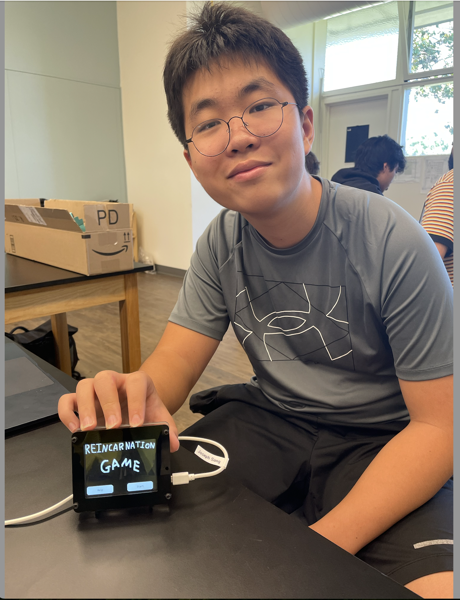

# Choose-Your-Own Adventure Display


My project is a Choose-Your-Own Adventure Display, a small screen that allows you to play a story-based multiple-choice story with multiple endings. I also created a second AI chapter using ChatGPT. Making this game was surprisingly tough, but it was a fun, interesting, and productive project. 

| **Engineer** | **School** | **Area of Interest** | **Grade** |
|:--:|:--:|:--:|:--:|
| Joseph S| Palo Alto Highschool | Software Engineering | 9th Grade



# Modification Milestone

<iframe width="560" height="315" src="https://www.youtube.com/embed/MgsUW-FxKSU?si=IvxY5zGIMVkSXT45" title="YouTube video player" frameborder="0" allow="accelerometer; autoplay; clipboard-write; encrypted-media; gyroscope; picture-in-picture; web-share" referrerpolicy="strict-origin-when-cross-origin" allowfullscreen></iframe>

## Summary
For my modifications, I added a second chapter to my story using AI. I followed the directions in the project book for the AI Choose-Your-Own-Adventure project. Using the existing programs from my first project and an API key I got from OpenAI, I can input text into ChatGPT. Then, when ChatGPT responds, I can display the given text to make the game. The AI is encouraged to create an adventure in the first input and to give numbered choices, which we can select by the four numbered buttons, displayed using bitmap images, that each sends a number back into ChatGPT. Now, even if we respond with numbers, the AI can understand our true meaning and process how to respond to this decision. 


>Figure 1: A flowchart of my modifications (Yellow cards are the modifications I made)

## Challenges
One of the challenges of this milestone was making the connections between my first and second Python scripts. I experimented with ```exec()``` functions, importing the other code or using naming conventions built into CIRCUITPY, to no avail. The answer was comically simple: putting the code underneath my first code. It seemed a bit rudimentary, but it worked. Another challenge I faced was my memory allocation failing when trying to display the adventure responses from ChatGPT. The maximum number of lines was 26, and only 15 were generated, so I needed clarification from my parents about the issue. The problem lies in the PyPortal trying to load the next text while still rendering the first text, which surpassed the maximum lines and caused a crash. I fixed this problem by resetting the page every time the button was pressed and creating blank lines between each screen so that the PyPortal loads the first and a blank text and then loads the second and the same blank text. This solves the issue since the AI is discouraged from creating lines larger than 15, thus making it improbable that the text will surpass 26 lines.


>Figure 2: A picture of my AI game

## What I Learned & What I’ll Do Next
My modifications taught me skills focused on AI and transporting data from one device to another. A big part of learning this milestone was about API keys. API keys are a password of sorts that allows you to contact an AI. By calling an API key, you can make devices that traditionally couldn’t use AI such as the PyPortal input and output into a model of ChatGPT.  I also learned about formatting when displaying and using the coordinate plane to move displayed objects. I also worked a good bit around SD cards and taught myself how to mount SD cards. When the SD cards were bugged, I learned to work around and prevent the corruption of SD cards. Moving forward, I want to create an article that follows my endeavors and the debate on AI creation. This particular argument interests me due to my high regard for AI, and I wanted to give my side of the argument but didn’t have the experience or project to make my point noticeable. Now that I have the perfect project to use as a starting point and as an example, I want to make this article a reality.

## Last Part Original Code Change

```
while True:
    print("Current card:", current_card)
    current_card = gfx.display_card(current_card)
    if current_card >= 101:
        break
```
## Ai Portion Code (Full Code Bottom)

```
def ok_step(forced_choice=None):
    if forced_choice:
        choice = forced_choice
    else:
        choice = get_touchscreen_choice()
    wrapped_text_display.add_text(f"\nPLAYER: {choice}")
    wrapped_text_display.scroll_to_end()
    wrapped_text_display.refresh()

    prompt = make_full_prompt(choice)
    for _ in range(3):
        result = get_one_completion(prompt)
        if result is not None:
            break
    else:
        raise ValueError("Error getting completion from OpenAI")
    print(result)
    wrapped_text_display.set_text(result)
    wrapped_text_display.refresh()


try:
    ok_step("New game")
    while True:
        ok_step()
except Exception as e: # pylint: disable=broad-except
    traceback.print_exception(e) # pylint: disable=no-value-for-parameter
    print_wrapped("An error occurred (more details on REPL).\nTouch the screen to re-load")
    board.DISPLAY.refresh()
    get_touchscreen_choice()
    supervisor.reload()
```


>Figure 3: Pros and Cons of AI

>Credit: https://adamfard.com/blog/impact-of-ai-in-business

# Final Milestone

<iframe width="560" height="315" src="https://www.youtube.com/embed/MgsUW-FxKSU?si=IvxY5zGIMVkSXT45" title="YouTube video player" frameborder="0" allow="accelerometer; autoplay; clipboard-write; encrypted-media; gyroscope; picture-in-picture; web-share" referrerpolicy="strict-origin-when-cross-origin" allowfullscreen></iframe>


## Summary
For my third milestone, I used the plans and artwork made in the second milestone and implemented them on the PyPortal. Using the library adafruit_pyoa, which stands for PyPortal’s framework for a Choose-Your-Own-Adventure game, I could easily add and edit the text and visual elements I had planned before using JSON files. This format is readable by both users and the computer, which stores my data for my text and links every button with the corresponding text. I divided some larger text boxes into multiple slides and improved some designs to better fit with the display. I also worked on a flowchart of my project to make the project simpler to understand and give basic blueprints to make similar products.


>Figure 4: A flowchart to explain how my ChatGPT functions

For a quick explanation, card 1 is requested to be used when the game starts. To prepare card 1, it grabs card data, such as the graphic and text databases. With the data, it puts the product on the display, where it waits for a button press. If they don’t press a button, it will loop until a button is pressed, where the card linked to the button repeats the same process.

## Challenges
One challenge I faced during my construction was managing the text boxes. The text buttons frequently overlapped with the other buttons, and there weren’t enough functions to move the text. I instead found the solution in simply “brute-forcing” it and making additional slides with one button. This turned out to be pretty helpful and made the game feel a lot better since it felt like 
an actual adventure with progression.  


>Figure 5: An example of the errors I encountered for this Milestone

Another problem I faced was with the flowchart to explain my project. Before I made the chart, I thought I knew pretty well what my code was about. I was quickly proven wrong, and what I thought would be an easy task was the most time-consuming part of the project. However, I've created a diagram that I am satisfied with.


## What I Learned/Moving Forward
The skills I learned for milestone three mostly centered around figuring out how to work with JSON files and the PYOA commands given by CircuitPython. However, I also learned about how my own code functioned, how to display images, and a deeper understanding of flowcharts that built onto my previous knowledge. Moving forward, I decided to work on a second AI chapter where the characters given in the first chapter would determine the AI's narrative. In addition, I plan to use the two projects to talk about something that interested me for a long time: Human Effort vs AI generation from a game-making perspective.


# Second Milestone


<iframe width="560" height="315" src="https://www.youtube.com/embed/I3SnmDUYsEY?si=zgpjrPx7nCRlBMiU" title="YouTube video player" frameborder="0" allow="accelerometer; autoplay; clipboard-write; encrypted-media; gyroscope; picture-in-picture; web-share" referrerpolicy="strict-origin-when-cross-origin" allowfullscreen></iframe>

## Summary
For my second milestone, I implemented a custom story and custom visuals into my adventure. I planned my story using flowcharts designed in Lucidchart. I drew visuals using Pixilart, and exported them as bitmaps in my game folder. My code checks for SD cards and uses the libraries given to me to run the game, find the game folder, and keep track of what card the game is on. In addition, I had plans for an additional AI adventure at the end of my story, which required a story that would naturally transition from the main story to the AI aspect. I chose to base my story around reincarnation, with the characters from the first adventure influencing the gameplay in the second. I used Lucidchart to convert the story into a Choose-Your-Own-Adventure format, where I organized my thoughts using color coding. I also used many ideas that were thrown around the classroom as inspiration for many of my endings. To enhance the retro text adventure feel, I created the ending visuals using a pixel-art website. Additionally, I tested all the components to make sure they can be displayed easily.


>Figure 6: (Top) Pixel Art program I used

>Figure 7: (Bottom) Image of one of the endings with a Pixelart on the PyPortal

## Challenges
One of the toughest parts of this milestone was the beginning, where I needed to decide the story I was aiming for. It was difficult for me to find a subject that transitioned well while also fitting my interests. In addition, I also wasted some time fiddling with an idea of a far more complex mechanic that I needed to scrap because I couldn’t find a way to create and save new data. Image formatting was also quite a problem, as finding the correct image for the bitmap program was like finding a needle in a haystack. I eventually discovered I needed a pixel-perfect bitmap in order for the program to function. The rest of the project involved work that wasn’t complex but needed time, such as the art or the flowchart. 


>Figure 8: (Top) The flowchart I used to assemble my story

>Figure 9: (Bottom) Close up of Top Image

## What I Learned & What I’ll Do Next
I learned more about the PyPortal during this milestone and experimented with its capabilities and shortcomings. I also improved at constructing flowcharts, and I can now clearly display thoughts and ideas with color-coding to explain without words. Finally, I learned the basics of pixel art and image files such as bitmaps and SVG files. Moving forward, I need to work on assembling the adventure. This will make it so the PyPortal displays my adventure with my story and visuals. I resolved most of the difficulties of this stage during this milestone, so I plan to finish this milestone quickly. My modifications are a whole new project, so I hope to acquire as much time as possible.


# First Milestone


 <iframe width="560" height="315" src="https://www.youtube.com/embed/1DFSt7tJ0po?si=ZlgEAwYYKRw2jAyx" title="YouTube video player" frameborder="0" allow="accelerometer; autoplay; clipboard-write; encrypted-media; gyroscope; picture-in-picture; web-share" referrerpolicy="strict-origin-when-cross-origin" allowfullscreen></iframe>
 


>Figure 10: Image of Choose-Your-Own-Adventure Books
>Credit: https://www.cyoa.com/

## Summary
For my main project, the Choose-Your-Own-Adventure Display(206), I've made significant progress. This project was chosen due to my interest in text adventures and the classic choose-your-own-adventure books. In addition, I was most excited about my ideas for modifications out of all the projects. I've successfully built the stand for the screen, installed the necessary programs, and debugged the code to make the PyPortal (The Display Machine) show an example adventure from the Project Book. This adventure includes coded buttons, music, different backgrounds, paths, and endings.

## Components & Code Explanation
The physical components were a PyPortal, a Stand, and a USB cable. The stand supports the screen, and the USB connects the portal to my MacBook. Everything comes from the portal, including the files and code from my computer. The files came from a built-in library in my CIRCUITPY drive, where many vital aspects, such as the buttons, touchscreen, and music, all come from files the code uses to create the experience. 

Out of all the files in the library, the most important file that makes the game function is the PYOA import. The PYOA import is the official framework for choosing your adventure for the portal. It is also the program that triggers the sound effects, sets the background and text, and displays transition animation.

**↓See Below for More Information↓**

The primary code’s purpose is to access JSON files using the load.game command, where a list of multiple dictionaries, each acting as “cards.”(Which is also part of PYOA) The cards are like a page in a slide deck, each showing a different visual. Each dictionary contains different aspects of the card, like the text, the color of said text, the background, and much more. The code tells the portal to change cards according to the user's button input, creating the game. 


>Figure 11: Image illustrating the connection between the PyPortal and the computer

## Challenges
My first two steps for the project, assembling the stand and gathering the correct programs, weren’t too difficult. The real challenge came from debugging the code from the project book. The code was built on a previous version of CircuitPython, the portal program, which meant some folders didn’t exist, and some code was outdated from the current version of Python. This meant I had to improvise, and most of my time was spent experimenting and seeing what worked and what didn’t. Constantly running into errors was frustrating, and some errors like a RunTimeError that happens in a file that doesn’t exist continuously appeared, even if I had made the slightest tweak. After many debugging and troubleshooting attempts, I discovered a folder filled with needed PYOA data, and adding the massive folder seemed to work. It wasn’t a pleasant experience, but I finished within my second week.

## What I Learned & What I’ll Do Next
In my first milestone, I primarily learned about coding. I learned about entering commands into the terminal and its usefulness for downloading resources with pip commands. I’ve learned many tips and tricks for CircuitPython, which will be especially important later in the project. Finally, I’ve found the basic principle of decoding and solving error messages, which is going to be something I’ll have to master if I want to code later in life. For what I’ll do next, I plan to start drafting my ideas for my adventure. Furthermore, I want to start on my visuals, in which I plan to use simple pixel art inspired by another text-based RPG I was inspired by. 


 ## Main Code

```
# SPDX-FileCopyrightText: 2021 ladyada for Adafruit Industries
# SPDX-License-Identifier: MIT

import board
import storage
from adafruit_pyoa import PYOA_Graphics

try:
    try:
        import sdcardio

        spi = board.SPI()
        sd_cs = board.SD_CS
        sdcard = sdcardio.SDCard(spi, sd_cs)
    except ImportError:
        import adafruit_sdcard
        import digitalio

        sdcard = adafruit_sdcard.SDCard(
            board.SPI(),
            digitalio.DigitalInOut(board.SD_CS),
        )
    vfs = storage.VfsFat(sdcard)
    storage.mount(vfs, "/sd")
    print("SD card found")  # no biggie
except OSError:
    print("No SD card found")  # no biggie

gfx = PYOA_Graphics()

gfx.load_game("/cyoa")
current_card = 0  # start with first card

while True:
    print("Current card:", current_card)
    current_card = gfx.display_card(current_card)

```
## JSON File

 ```
[
  {
    "card_id": "startup",
    "background_image": "startup.bmp",
    "sound": "startup.wav",
    "auto_advance": "5"
  },
  {
    "card_id": "home",
    "background_image": "home.bmp",
    "sound": "home.wav",
    "sound_repeat": "True",
    "button01_text": "Help",
    "button01_goto_card_id": "help",
    "button02_text": "Start",
    "button02_goto_card_id": "want to build?"
  },

  {
    "card_id": "want to build?",
    "background_image": "page01.bmp",
    "text": "You do not have any friends so you decide that it might be a good idea to build a robot friend. You're unsure if you want to do this, so now is the time to decide. Do you want to build a robot friend?",
    "text_color": "0x000001",
    "text_background_color": "0xeeeeee",
    "sound": "sound_01.wav",
    "button01_text": "Yes",
    "button01_goto_card_id": "continue?",
    "button02_text": "No",
    "button02_goto_card_id": "lazy"
  },
  {
    "card_id": "continue?",
    "background_image": "page02.bmp",
    "text": "You spend all day, then all week, then all month building a robot, everyone stops talking to you, however a lot of progress has been made. Do you want to keep making the robots?",
    "text_color": "0xFFFFFF",
    "button01_text": "Yes",
    "button01_goto_card_id": "robot friend",
    "button02_text": "No",
    "button02_goto_card_id": "lazy"
  },
  {
    "card_id": "robot friend",
    "background_image": "page03.bmp",
    "text": "The robot is now you're friend, everyone else wishes they had a robot, this is the best thing ever. Good work!",
    "text_color": "0xFFFFFF",
    "sound": "Mystery.wav",
    "button01_text": "Next",
    "button01_goto_card_id": "happy ending"
  },
  {
    "card_id": "lazy",
    "background_image": "page04.bmp",
    "sound": "sound_04.wav",
    "text": "Welp, not only will you not have any friends, you are lazy. What's the point of playing? Try again.",
    "text_color": "0xFFFFFF",
    "button01_text": "Start Over",
    "button01_goto_card_id": "home"
  },
  {
    "card_id": "help",
    "background_image": "help.bmp",
    "text": "All you need to do is click the buttons, that's it.\nThis is a new line.",
    "text_color": "0xFFFFFF",
    "button01_text": "Home",
    "button01_goto_card_id": "home"
  },
 {
    "card_id": "happy ending",
    "background_image": "happyending.bmp",
    "sound": "happy_ending.wav",
    "sound_repeat": "True",
    "button01_text": "Home",
    "button01_goto_card_id": "home"
  }
]
```

 # Bill of Materials

 | **Part** | **Note** | **Price** | **Link** |
 |:--:|:--:|:--:|:--:|
 | Adafruit PyPortal - CircuitPython Powered Internet Display | Used to display the project | $54.95 | <a href="https://www.adafruit.com/product/4116"> Link </a> |
 | Adafruit PyPortal Desktop Stand Enclosure Kit | Used to keep the portal vertical | $9.95 | <a href="https://www.adafruit.com/product/4146"> Link </a> |
 | USB A/Micro Cable - 2m | Used to connect the PyPortal to the computer | $4.95 | <a href="https://www.adafruit.com/product/2185"> Link </a> |

# Starter Project

<iframe width="560" height="315" src="https://www.youtube.com/embed/DByS1SLt-O0?si=E4YeEYrHOiGyVLPe" title="YouTube video player" frameborder="0" allow="accelerometer; autoplay; clipboard-write; encrypted-media; gyroscope; picture-in-picture; web-share" referrerpolicy="strict-origin-when-cross-origin" allowfullscreen></iframe>


## Summary
My project was the BlueStamp Ardunio Starter. I chose this project because I enjoyed the creative freedom it gave me, which allowed me to tinker and create freely. It also offered incredibly convenient skills to have later in life, such as circuitry, soldering, and coding. I decided to build a simple ultrasonic detection system that measures the distance between the object it detects and itself and blinks an LED when the object is 20cm or closer.

## Components
The project comprised an Arduino Uno, a breadboard, an ultrasonic sensor, an LED, resistors, and numerous jumper cables. The main system moves the inputs from the sensor to the Arduino, and a mini system blinks the LED. The sensor is the main component of the whole system and functions by shooting a beam of ultrasound. The beam travels until it hits an object, bouncing back into the sensor. Then, the system calculates the object’s distance by using the time it took for the beam to return to the sensor and the speed of sound, using the formula distance = speed x time. After transporting the data to the computer, it prints in the serial monitor, is brought into an if statement that questions if the distance is less than 20cm, and lights the LED if true.


>Figure 12: Model illustrating the functions of an ultrasonic sensor Credit: www.TheEnginneringProjects.com

## Challenges
The main challenges I faced were the technical and physical aspects. With zero experience with circuitry, I frequently made mistakes, such as plugging wires in the wrong parts, leading to obstacles that could have been solved within seconds with proper knowledge. In addition, I had some problems with soldering and ended up with a crooked proto shield, so I had to resort to the breadboard. However, the sensors were the most exhausting part of this project. I first worked on a motion sensor, but after receiving underwhelming accuracy in the readings, I restarted the project, switched to ultrasonic sensors, and went through two more buggy sensors until I finally found one that worked.

## What I Learned
Overall, this was an amazing experience and something that will come into use later. I learned many skills I expected, like soldering and circuitry. Still, I also learned niche things I wouldn’t find without physical experiences, such as double-checking technology and simplifying circuitry. It challenged my problem-solving skills and tested my patience and resilience. After this project, I want to move on to my main project, which I’m truly looking forward to. The skills I learned will be crucial to this much larger task.

## Code
```
const int trigPin = 9;
const int echoPin = 10;
// defines variables
long duration;
int distance;
void setup() {
  pinMode(trigPin, OUTPUT);
  pinMode(13, OUTPUT); // Sets the trigPin as an Output
  pinMode(echoPin, INPUT); // Sets the echoPin as an Input
  Serial.begin(9600); // Starts the serial communication
}
void loop() {
  // Clears the trigPin
  digitalWrite(trigPin, LOW);
  digitalWrite(13, LOW);// Turns LED off 
  delay(100);
  // Sets the trigPin on HIGH state for 10 micro seconds
  digitalWrite(trigPin, HIGH);
  delay(100);
  digitalWrite(trigPin, LOW);
  // Reads the echoPin, returns the sound wave travel time in microseconds
  duration = pulseIn(echoPin, HIGH);
  // Calculating the distance

  distance = (duration * .034300) / 2;
  // Prints the distance on the Serial Monitor
  if ((distance)<20){ // Checks if the sensor detects an object that is too close to it
    digitalWrite(13, HIGH);//Turns the LED on
  }
  Serial.print("Distance: ");
  Serial.println(distance);
  delay(100);
}
```

## New Code

```
# SPDX-FileCopyrightText: 2023 Jeff Epler for Adafruit Industries
# SPDX-License-Identifier: MIT
import os
import traceback
import adafruit_connection_manager
import adafruit_requests
import adafruit_touchscreen
from adafruit_ticks import ticks_ms, ticks_add, ticks_less
from adafruit_bitmap_font.bitmap_font import load_font
from adafruit_display_text.bitmap_label import Label
from adafruit_display_text import wrap_text_to_pixels
import displayio
import supervisor
import terminalio
from adafruit_esp32spi import adafruit_esp32spi
from digitalio import DigitalInOut

# Use
# https://github.com/adafruit/Adafruit_CircuitPython_Touchscreen/blob/main/examples/touchscreen_calibrator_built_in.py
# to calibrate your touchscreen
touchscreen_calibration=((6616, 60374), (8537, 57269))


# set to True to use openapi, False for quicker testing of the rest of the game
# logic
use_openai = True

# Place the key in your settings.toml file
openai_api_key = os.getenv("OPENAI_API_KEY")

# Select a 14-point font for the PyPortal titano, 10-point for original & Pynt
nice_font = load_font("helvR10.pcf")
line_spacing = 0.50

# Customize this prompt as you see fit to create a different experience
if current_card == 101:

    base_prompt = """
    You are an AI helping the player play an endless text adventure game. You will stay in character as the GM.

    The story starts with being reincarnated as a bean\
    You follow the journey of a bean who lives in beantown.\
    A dark magician named black bean attacked beantown and took bean's bean wife.
    Now bean goes through the black bean's tower to save bean wife.\
    Focus on the comedy of this adventure (Do Not Tell the Player This)\


    As GM, never let the player die; they always survive a situation, no matter how \
    harrowing.

    At each step:
        * Offer a short description of my surroundings (1 paragraph)
        * List the items I am carrying, if any
        * Offer me 4 terse numbered action choices (1 or 2 words each)

    In any case, be relatively terse and keep word counts small.

    In case the player wins (or loses) start a fresh game.
    """
elif current_card == 102:

    base_prompt = """
    You are an AI helping the player play an endless text adventure game. You will stay in character as the GM.

    The story starts with being reincarnated as a Crash Test Dummy\
    The goal of the game is to escape the factory that you were trapped in. \
    You in the body of a crash test dummy, and you have to escape the factory owners from selling you. \
    Along the way, you make friends from the other prisoners of this horrid factory\
    Make the story feel like a thriller/horror story(Do Not Tell the Player This)\


    As GM, never let the player die; they always survive a situation, no matter how \
    harrowing.

    At each step:
        * Offer a short description of my surroundings (1 paragraph)
        * List the items I am carrying, if any
        * Offer me 4 terse numbered action choices (1 or 2 words each)

    In any case, be relatively terse and keep word counts small.

    In case the player wins (or loses) start a fresh game.
    """
elif current_card == 103:

    base_prompt = """
    You are an AI helping the player play an endless text adventure game. You will stay in character as the GM.

    The story starts with being reincarnated as a horseshoe\
    The goal of the game is to survive in the wildness\
    You have the magical abilities to possess any animal that wears the horseshoe.
    The world in fantasy, with goblins, dragons, and much more, you are a precious item and every wants to hunt you down\
    Take inspiration from isekai novels and DnD(Do Not Tell the Player This)\


    As GM, never let the player die; they always survive a situation, no matter how \
    harrowing.

    At each step:
        * Offer a short description of my surroundings (1 paragraph)
        * List the items I am carrying, if any
        * Offer me 4 terse numbered action choices (1 or 2 words each)

    In any case, be relatively terse and keep word counts small.

    In case the player wins (or loses) start a fresh game.
    """
elif current_card == 104:

    base_prompt = """
    You are an AI helping the player play an endless text adventure game. You will stay in character as the GM.

    The story starts with being reincarnated as a martial artist\
    The goal of the game is to become the greatest martial artist by attending a prestigous tournament\
    You go into the tournament as one of four fighting styles:
    1. Chinese Animal Martial Arts
    2. Drunken Fist
    3. Sumo
    4. Goku
    The opponents all have special abilities, that challenge the player.\
    You are currently getting ready to fight your first opponent\
    Take inspiration from novels such as God of Highschool (Do Not Tell the Player This)\


    As GM, never let the player die; they always survive a situation, no matter how \
    harrowing.

    At each step:
        * Offer a short description of my surroundings (1 paragraph)
        * List the items I am carrying, if any
        * Offer me 4 terse numbered action choices (1 or 2 words each)

    In any case, be relatively terse and keep word counts small.

    In case the player wins (or loses) start a fresh game.
    """
elif current_card == 105:

    base_prompt = """
    You are an AI helping the player play an endless text adventure game. You will stay in character as the GM.

    The story starts with being reincarnated as a cup of coffee\
    The goal of the game is to train your boxers to become world champions\
    You got the magical abilities to create champions within months by punching you\
    You give advice to the boxers, and them winning their matches gives you money\
    With money, you can buy better tools, more coaches, and much more\

    As GM, never let the player die; they always survive a situation, no matter how \
    harrowing.

    At each step:
        * Offer a short description of my surroundings (1 paragraph)
        * List the items I am carrying, if any
        * Offer me 4 terse numbered action choices (1 or 2 words each)

    In any case, be relatively terse and keep word counts small.

    In case the player wins (or loses) start a fresh game.
    """
elif current_card == 106:

    base_prompt = """
    You are an AI helping the player play an endless text adventure game. You will stay in character as the GM.

    The story starts with being reincarnated as a crab\
    The goal of this game is to survive as in the island as a crab\
    Many predators and danger lurk on this island, and you need to find food and materials\
    The crabs needs to eat food when it's hungry, and needs to find a shelter to avoid predators\


    As GM, never let the player die; they always survive a situation, no matter how \
    harrowing.

    At each step:
        * Offer a short description of my surroundings (1 paragraph)
        * List the items I am carrying, if any
        * Offer me 4 terse numbered action choices (1 or 2 words each)

    In any case, be relatively terse and keep word counts small.

    In case the player wins (or loses) start a fresh game.
    """

elif current_card == 107:

    base_prompt = """
    You are an AI helping the player play an endless text adventure game. You will stay in character as the GM.

    The story starts with being reincarnated as a cup of coffee\
    The goal of this game to find a lover as a cup of coffee\
    Try to keep the story-telling similar to a romance novel (Do Not Tell the Player This)\


    As GM, never let the player die; they always survive a situation, no matter how \
    harrowing.

    At each step:
        * Offer a short description of my surroundings (1 paragraph)
        * List the items I am carrying, if any
        * Offer me 4 terse numbered action choices (1 or 2 words each)

    In any case, be relatively terse and keep word counts small.

    In case the player wins (or loses) start a fresh game.
    """
elif current_card == 108:

    base_prompt = """
    You are an AI helping the player play an endless text adventure game. You will stay in character as the GM.

    The story starts with being reincarnated as a yeti\
    The goal of this game is to defeat the 4 Elemental Beasts that been terrorzing your town\
    You go on the quest with two fellow yeti's to defeat them to stop their tyranny\
    Make the world feel like an Open RPG game (Do Not Tell the Player This)\


    As GM, never let the player die; they always survive a situation, no matter how \
    harrowing.

    At each step:
        * Offer a short description of my surroundings (1 paragraph)
        * List the items I am carrying, if any
        * Offer me 4 terse numbered action choices (1 or 2 words each)

    In any case, be relatively terse and keep word counts small.

    In case the player wins (or loses) start a fresh game.
    """
elif current_card == 109:

    base_prompt = """
    You are an AI helping the player play an endless text adventure game. You will stay in character as the GM.

    The story starts with being reincarnated as Mr.Beast\
    You know hold the job of creating video ideas and making them\
    There's also many wack twists and turn throughout the story(Do Not Tell the Player This)\


    As GM, never let the player die; they always survive a situation, no matter how \
    harrowing.

    At each step:
        * Offer a short description of my surroundings (1 paragraph)
        * List the items I am carrying, if any
        * Offer me 4 terse numbered action choices (1 or 2 words each)

    In any case, be relatively terse and keep word counts small.

    In case the player wins (or loses) start a fresh game.
    """
elif current_card == 110:

    base_prompt = """
    You are an AI helping the player play an endless text adventure game. You will stay in character as the GM.

    The story starts with being reincarnated as a sandwhich\
    Surprisingly, everyone sees you as the greatest chef of all time, McCheffyCookChefChef\
    You needd to now hide your identify, as being found out would stop you of this amazing life\
    Take inspiration from films like Ratatouie or shows like Master Chef(Do Not Tell the Player This)\


    As GM, never let the player die; they always survive a situation, no matter how \
    harrowing.

    At each step:
        * Offer a short description of my surroundings (1 paragraph)
        * List the items I am carrying, if any
        * Offer me 4 terse numbered action choices (1 or 2 words each)

    In any case, be relatively terse and keep word counts small.

    In case the player wins (or loses) start a fresh game.
    """
elif current_card == 112:

    base_prompt = """
    You are an AI helping the player play an endless text adventure game. You will stay in character as the GM.

    The story starts with being reincarnated as Sherlock Holmes\
    Every day, someone gives you a mystery to solve with your partner Watson\
    Make the adventure feel like the original sherlock holmes series(Do Not Tell the Player This)\


    As GM, never let the player die; they always survive a situation, no matter how \
    harrowing.

    At each step:
        * Offer a short description of my surroundings (1 paragraph)
        * List the items I am carrying, if any
        * Offer me 4 terse numbered action choices (1 or 2 words each)

    In any case, be relatively terse and keep word counts small.

    In case the player wins (or loses) start a fresh game.
    """
elif current_card == 113:

    base_prompt = """
    You are an AI helping the player play an endless text adventure game. You will stay in character as the GM.

    The story starts with being reincarnated as an mimic\
    You been inherited a small dungeon from your father, and it's your job to manage it\
    You manage the traps, monsters, and treasure of the dungeon\
    Protect the dungeon from adventurors and get money to add more traps and monsters\
    Make the dungeon feel like a scene from "The Office"(Do Not Tell the Player This)\


    As GM, never let the player die; they always survive a situation, no matter how \
    harrowing.

    At each step:
        * Offer a short description of my surroundings (1 paragraph)
        * List the items I am carrying, if any
        * Offer me 4 terse numbered action choices (1 or 2 words each)

    In any case, be relatively terse and keep word counts small.

    In case the player wins (or loses) start a fresh game.
    """
elif current_card == 114:

    base_prompt = """
    You are an AI helping the player play an endless text adventure game. You will stay in character as the GM.

    The story starts with being reincarnated as a pile of ash\
    You drift through the world as an ash spirit, haunting people who have wronged you\
    You have a rival, the Scooby Doo Gang, that you need to escape to hanut once more\
    Phrase the story like a scooby doo episode(Do Not Tell the Player This)\


    As GM, never let the player die; they always survive a situation, no matter how \
    harrowing.

    At each step:
        * Offer a short description of my surroundings (1 paragraph)
        * List the items I am carrying, if any
        * Offer me 4 terse numbered action choices (1 or 2 words each)

    In any case, be relatively terse and keep word counts small.

    In case the player wins (or loses) start a fresh game.
    """
elif current_card == 115:

    base_prompt = """
    You are an AI helping the player play an endless text adventure game. You will stay in character as the GM.

    The story starts with being reincarnated as a UNO God\
    You become the god of the UNO nation, and you now hold the power to change the empire by your whim\
    You command the country to new heights, and surpass your fellow nations\
    The other nations are also inspired by board games\
    You can conquer, engineer, create faith, or create diplomancy in this world\
    Make the expierence feel like a Civilization 6 Game(Do Not Tell the Player This)\


    As GM, never let the player die; they always survive a situation, no matter how \
    harrowing.

    At each step:
        * Offer a short description of my surroundings (1 paragraph)
        * List the items I am carrying, if any
        * Offer me 4 terse numbered action choices (1 or 2 words each)

    In any case, be relatively terse and keep word counts small.

    In case the player wins (or loses) start a fresh game.
    """
clear='\033[2J'

# variable for setup requests.Session
requests = None

# pylint: disable=global-statement
def set_up_wifi():
    global requests

    print(end=clear)
    if openai_api_key is None:
        print(
            "please set OPENAPI_API_KEY in settings.toml"
        )
        raise SystemExit

    wifi_ssid = os.getenv('WIFI_SSID')
    wifi_password = os.getenv('WIFI_PASSWORD')
    if wifi_ssid is None:
        print(
            "please set WIFI_SSID and WIFI_PASSWORD in settings.toml"
        )
        raise SystemExit

    esp_cs = DigitalInOut(board.ESP_CS)
    esp_ready = DigitalInOut(board.ESP_BUSY)
    esp_reset = DigitalInOut(board.ESP_RESET)

    spi = board.SPI()
    esp = adafruit_esp32spi.ESP_SPIcontrol(spi, esp_cs, esp_ready, esp_reset)
    pool = adafruit_connection_manager.get_radio_socketpool(esp)
    ssl_context = adafruit_connection_manager.get_radio_ssl_context(esp)
    requests = adafruit_requests.Session(pool, ssl_context)

    while not esp.is_connected:
        print("Connecting to AP...")
        try:
            esp.connect_AP(wifi_ssid, wifi_password)
        except Exception as e: # pylint: disable=broad-except
            print("could not connect to AP, retrying: ", e)
            for ap in esp.scan_networks():
                print("%-24s RSSI: %d" % (str(ap["ssid"], "utf-8"), ap["rssi"]))
            continue
    print("Connected to WiFi")

def terminal_label(text, width_in_chars, palette, x, y):
    label = displayio.TileGrid(terminalio.FONT.bitmap, pixel_shader=palette,
        width=width_in_chars, height=2, tile_width=glyph_width,
        tile_height=glyph_height)
    label.x = x
    label.y = y
    term = terminalio.Terminal(label, terminalio.FONT)
    term.write(f"{text: ^{width_in_chars-1}}")
    return label

def terminal_palette(fg=0xffffff, bg=0):
    p = displayio.Palette(2)
    p[0] = bg
    p[1] = fg
    return p

class WrappedTextDisplay:
    def __init__(self):
        self.line_offset = 0
        self.lines = []

    def add_text(self, text):
        self.lines.extend(wrap_text_to_pixels(text, use_width, nice_font))

    def set_text(self, text):
        self.lines = wrap_text_to_pixels(text, use_width, nice_font)
        self.line_offset = 0

    def scroll_to_end(self):
        self.line_offset = self.max_offset()

    def scroll_next_line(self):
        max_offset = self.max_offset()
        if max_offset > 0:
            line_offset = self.line_offset + 1
            self.line_offset = line_offset % (max_offset + 1)

    def max_offset(self):
        return max(0, len(self.lines) - max_lines)

    def on_last_line(self):
        return self.line_offset == self.max_offset()

    def refresh(self):
        text = '\n'.join(self.lines[self.line_offset : self.line_offset + max_lines])
        board.DISPLAY.refresh()
        terminal.text = ""
        board.DISPLAY.refresh()
        terminal.text = text
        board.DISPLAY.refresh()
wrapped_text_display = WrappedTextDisplay()

def print_wrapped(text):
    wrapped_text_display.set_text(text)
    wrapped_text_display.refresh()

def make_full_prompt(action):
    return session + [{"role": "user", "content": f"PLAYER: {action}"}]

def record_game_step(action, response):
    session.extend([
        {"role": "user", "content": f"PLAYER: {action}"},
        {"role": "assistant", "content": response.strip()},
    ])
    # Keep a limited number of exchanges in the prompt
    del session[1:-5]

def get_one_completion(full_prompt):
    if not use_openai:
        return f"""\
This is a canned response in offline mode. The player's last choice was as follows:
    {full_prompt[-1]['content']}

Lorem ipsum dolor sit amet, consectetur adipiscing elit, sed do eiusmod tempor \
incididunt ut labore et dolore magna aliqua. Nulla aliquet enim tortor at \
auctor urna. Arcu ac tortor dignissim convallis aenean et tortor at. Dapibus \
ultrices in iaculis nunc sed augue. Enim nec dui nunc mattis enim ut tellus \
elementum sagittis. Sit amet mattis vulputate enim nulla. Ultrices in iaculis \
nunc sed augue lacus. Pulvinar neque laoreet suspendisse interdum consectetur \
libero id faucibus nisl. Aenean pharetra magna ac placerat vestibulum lectus \
mauris ultrices eros. Imperdiet nulla malesuada pellentesque elit eget. Tellus \
at urna condimentum mattis pellentesque id nibh tortor. Velit dignissim sodales \
ut eu sem integer vitae. Id ornare arcu odio ut sem nulla pharetra diam sit.

1: Stand in the place where you live
2: Now face West
3: Think about the place where you live
4: Wonder why you haven't before
    """.strip()
    try:
        response = requests.post(
            "https://api.openai.com/v1/chat/completions",
            json={"model": "gpt-3.5-turbo", "messages": full_prompt},
            headers={
                "Authorization": f"Bearer {openai_api_key}",
            },
        )
    except Exception as e: # pylint: disable=broad-except
        print("requests exception", e)
        return None
    if response.status_code != 200:
        print("requests status", response.status_code)
        return None
    j = response.json()
    result = j["choices"][0]["message"]["content"]
    return result.strip()

def get_touchscreen_choice():
    # Wait for screen to be released
    while ts.touch_point:
        pass

    # Wait for screen to be pressed
    touch_count = 0
    deadline = ticks_add(ticks_ms(), 1000)
    while True:
        t = ts.touch_point
        if t is not None:
            touch_count += 1
            if touch_count > 5:
                break
        else:
            touch_count = 0
            if wrapped_text_display.max_offset() > 0 and ticks_less(deadline, ticks_ms()):
                wrapped_text_display.scroll_next_line()
                wrapped_text_display.refresh()
                deadline = ticks_add(deadline,
                        5000 if wrapped_text_display.on_last_line() else 1000)

    # Depending on the quadrant of the screen, make a choice
    x, y, _ = t
    result = 1
    if x > board.DISPLAY.width / 2:
        result = result + 1
    if y > board.DISPLAY.height / 2:
        result = result + 2
    return result

def ok_step(forced_choice=None):
    if forced_choice:
        choice = forced_choice
    else:
        choice = get_touchscreen_choice()
    wrapped_text_display.add_text(f"\nPLAYER: {choice}")
    wrapped_text_display.scroll_to_end()
    wrapped_text_display.refresh()

    prompt = make_full_prompt(choice)
    for _ in range(3):
        result = get_one_completion(prompt)
        if result is not None:
            break
    else:
        raise ValueError("Error getting completion from OpenAI")
    print(result)
    wrapped_text_display.set_text(result)
    wrapped_text_display.refresh()


    record_game_step(choice, result)

if use_openai:
    # Only set up wifi if using openai
    set_up_wifi()

# Set up the touchscreen
# These pins are used as both analog and digital! XL, XR and YU must be analog
# and digital capable. YD just need to be digital
ts = adafruit_touchscreen.Touchscreen(
    board.TOUCH_XL,
    board.TOUCH_XR,
    board.TOUCH_YD,
    board.TOUCH_YU,
    calibration=touchscreen_calibration,
    size=(board.DISPLAY.width, board.DISPLAY.height)
)

# Set up the 4 onscreen buttons & embedded terminal
main_group = displayio.Group()
main_group.x = 2
main_group.y = 2

# Determine the size of everything
glyph_width, glyph_height = terminalio.FONT.get_bounding_box()
use_height = board.DISPLAY.height - 4
use_width = board.DISPLAY.width - 4

# Game text is displayed on this wdget
terminal = Label(
    font=nice_font,
    color=0xFFFFFF,
    background_color=0,
    line_spacing=line_spacing,
    anchor_point=(0, -0.2),
    anchored_position=(0, glyph_height + 1),
)
max_lines = (use_height - 2 * glyph_height) // int(
    nice_font.get_bounding_box()[1] * terminal.line_spacing
)
main_group.append(terminal)

# Indicate what each quadrant of the screen does when tapped
label_width = use_width // (glyph_width * 2)
main_group.append(terminal_label('1', label_width, terminal_palette(0, 0xffff00), 0, 0))
main_group.append(terminal_label('2', label_width, terminal_palette(0, 0x00ffff),
    use_width - label_width*glyph_width, 0))
main_group.append(terminal_label('3', label_width, terminal_palette(0, 0xff00ff),
    0, 210))
main_group.append(terminal_label('4', label_width, terminal_palette(0, 0x00ff00),
    use_width - label_width*glyph_width, 210))

# Show our stuff on the screen
board.DISPLAY.auto_refresh = False
board.DISPLAY.root_group = main_group
board.DISPLAY.refresh()

# Track the game so far. ALways start with the base prompt.
session = [
        {"role": "system", "content": base_prompt.strip()},
]

try:
    ok_step("New game")
    while True:
        ok_step()
except Exception as e: # pylint: disable=broad-except
    traceback.print_exception(e) # pylint: disable=no-value-for-parameter
    print_wrapped("An error occurred (more details on REPL).\nTouch the screen to re-load")
    board.DISPLAY.refresh()
    get_touchscreen_choice()
    supervisor.reload()
```
# Other Resources/Examples

- [CircuitPython Pyoa Import](https://docs.circuitpython.org/projects/pyoa/en/latest/api.html)


