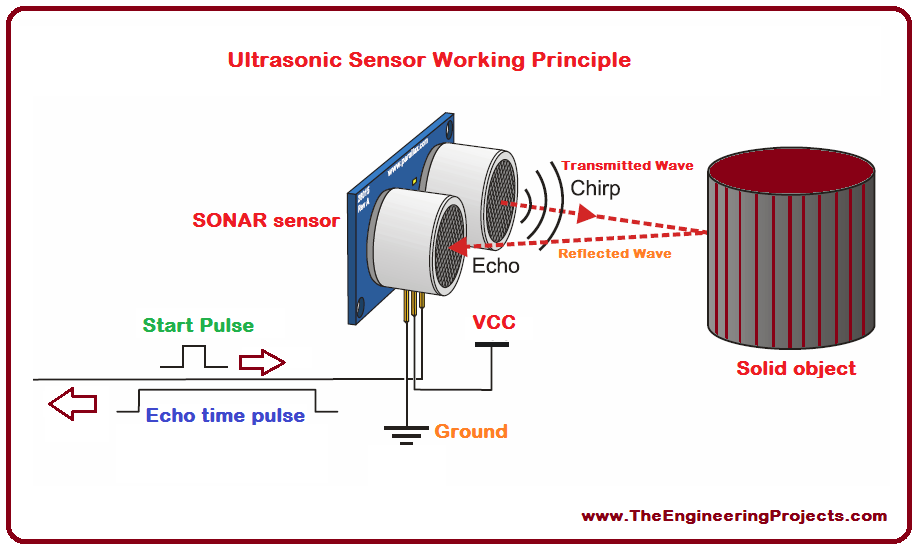

# Choose-Your-Own Adventure Display


<!---
Replace this text with a brief description (2-3 sentences) of your project. This description should draw the reader in and make them interested in what you've built. You can include what the biggest challenges, takeaways, and triumphs from completing the project were. As you complete your portfolio, remember your audience is less familiar than you are with all that your project entails!

You should comment out all portions of your portfolio that you have not completed yet, as well as any instructions:

| **Engineer** | **School** | **Area of Interest** | **Grade** |
|:--:|:--:|:--:|:--:|
| Joseph S| Palo Alto Highschool | Software Engineering | 9th Grade


**Replace the BlueStamp logo below with an image of yourself and your completed project. Follow the guide [here](https://tomcam.github.io/least-github-pages/adding-images-github-pages-site.html) if you need help.**


  
# Final Milestone

 **Don't forget to replace the text below with the embedding for your milestone video. Go to Youtube, click Share -> Embed, and copy and paste the code to replace what's below.**

 <iframe width="560" height="315" src="https://www.youtube.com/embed/F7M7imOVGug" title="YouTube video player" frameborder="0" allow="accelerometer; autoplay; clipboard-write; encrypted-media; gyroscope; picture-in-picture; web-share" allowfullscreen></iframe>

 For your final milestone, explain the outcome of your project. Key details to include are:
 - What you've accomplished since your previous milestone
 - What your biggest challenges and triumphs were at BSE
 - A summary of key topics you learned about
 - What you hope to learn in the future after everything you've learned at BSE


 # Second Milestone

 **Don't forget to replace the text below with the embedding for your milestone video. Go to Youtube, click Share -> Embed, and copy and paste the code to replace what's below.**

 <iframe width="560" height="315" src="https://www.youtube.com/embed/y3VAmNlER5Y" title="YouTube video player" frameborder="0" allow="accelerometer; autoplay; clipboard-write; encrypted-media; gyroscope; picture-in-picture; web-share" allowfullscreen></iframe>

 For your second milestone, explain what you've worked on since your previous milestone. You can highlight:
 - Technical details of what you've accomplished and how they contribute to the final goal
 - What has been surprising about the project so far
 - Previous challenges you faced that you overcame
 - What needs to be completed before your final milestone
-->
 # First Milestone


 <iframe width="560" height="315" src="https://www.youtube.com/embed/1DFSt7tJ0po?si=ZlgEAwYYKRw2jAyx" title="YouTube video player" frameborder="0" allow="accelerometer; autoplay; clipboard-write; encrypted-media; gyroscope; picture-in-picture; web-share" referrerpolicy="strict-origin-when-cross-origin" allowfullscreen></iframe>
 


>Credit: https://www.cyoa.com/

## Summary
For my main project, the Choose-Your-Own-Adventure Display(206), I've made significant progress. This project was chosen due to my interest in text adventures and the classic choose-your-own-adventure books. In addition, I was most excited about my ideas for modifications out of all the projects. I've successfully built the stand for the screen, installed the necessary programs, and debugged the code to make the PyPortal (The Display Machine) show an example adventure from the Project Book. This adventure includes coded buttons, music, different backgrounds, paths, and endings.

## Components & Code Explanation
The physical components were a PyPortal, a Stand, and a USB cable. The stand supports the screen, and the USB connects the portal to my MacBook. Everything comes from the portal, including the files and code from my computer. The files came from a built-in library in my CIRCUITPY drive, where many vital aspects, such as the buttons, touchscreen, and music, all come from files the code uses to create the experience. 

Out of all the files in the library, the most important file that makes the game function is the PYOA import. The PYOA import is the official framework for choosing your adventure for the portal. It is also the program that triggers the sound effects, sets the background and text, and displays transition animation.

**↓See Below for More Information↓**

The primary code’s purpose is to access JSON files using the load.game command, where a list of multiple dictionaries, each acting as “cards.”(Which is also part of PYOA) The cards are like a page in a slide deck, each showing a different visual. Each dictionary contains different aspects of the card, like the text, the color of said text, the background, and much more. The code tells the portal to change cards according to the user's button input, creating the game. 


>Figure: Image illustrating the connection between the PyPortal and the computer

## Challenges
My first two steps for the project, assembling the stand and gathering the correct programs, weren’t too difficult. The real challenge came from debugging the code from the project book. The code was built on a previous version of CircuitPython, the portal program, which meant some folders didn’t exist, and some code was outdated from the current version of Python. This meant I had to improvise, and most of my time was spent experimenting and seeing what worked and what didn’t. Constantly running into errors was frustrating, and some errors like a RunTimeError that happens in a file that doesn’t exist continuously appeared, even if I had made the slightest tweak. After many debugging and troubleshooting attempts, I discovered a folder filled with needed PYOA data, and adding the massive folder seemed to work. It wasn’t a pleasant experience, but I finished within my second week.

## What I Learned & What I’ll Do Next
In my first milestone, I primarily learned about coding. I learned about entering commands into the terminal and its usefulness for downloading resources with pip commands. I’ve learned many tips and tricks for CircuitPython, which will be especially important later in the project. Finally, I’ve found the basic principle of decoding and solving error messages, which is going to be something I’ll have to master if I want to code later in life. For what I’ll do next, I plan to start drafting my ideas for my adventure. Furthermore, I want to start on my visuals, in which I plan to use simple pixel art inspired by another text-based RPG I was inspired by. 


 ## Main Code

```
# SPDX-FileCopyrightText: 2021 ladyada for Adafruit Industries
# SPDX-License-Identifier: MIT

import board
import storage
from adafruit_pyoa import PYOA_Graphics

try:
    try:
        import sdcardio

        spi = board.SPI()
        sd_cs = board.SD_CS
        sdcard = sdcardio.SDCard(spi, sd_cs)
    except ImportError:
        import adafruit_sdcard
        import digitalio

        sdcard = adafruit_sdcard.SDCard(
            board.SPI(),
            digitalio.DigitalInOut(board.SD_CS),
        )
    vfs = storage.VfsFat(sdcard)
    storage.mount(vfs, "/sd")
    print("SD card found")  # no biggie
except OSError:
    print("No SD card found")  # no biggie

gfx = PYOA_Graphics()

gfx.load_game("/cyoa")
current_card = 0  # start with first card

while True:
    print("Current card:", current_card)
    current_card = gfx.display_card(current_card)

```
## JSON File

 ```
[
  {
    "card_id": "startup",
    "background_image": "startup.bmp",
    "sound": "startup.wav",
    "auto_advance": "5"
  },
  {
    "card_id": "home",
    "background_image": "home.bmp",
    "sound": "home.wav",
    "sound_repeat": "True",
    "button01_text": "Help",
    "button01_goto_card_id": "help",
    "button02_text": "Start",
    "button02_goto_card_id": "want to build?"
  },

  {
    "card_id": "want to build?",
    "background_image": "page01.bmp",
    "text": "You do not have any friends so you decide that it might be a good idea to build a robot friend. You're unsure if you want to do this, so now is the time to decide. Do you want to build a robot friend?",
    "text_color": "0x000001",
    "text_background_color": "0xeeeeee",
    "sound": "sound_01.wav",
    "button01_text": "Yes",
    "button01_goto_card_id": "continue?",
    "button02_text": "No",
    "button02_goto_card_id": "lazy"
  },
  {
    "card_id": "continue?",
    "background_image": "page02.bmp",
    "text": "You spend all day, then all week, then all month building a robot, everyone stops talking to you, however a lot of progress has been made. Do you want to keep making the robots?",
    "text_color": "0xFFFFFF",
    "button01_text": "Yes",
    "button01_goto_card_id": "robot friend",
    "button02_text": "No",
    "button02_goto_card_id": "lazy"
  },
  {
    "card_id": "robot friend",
    "background_image": "page03.bmp",
    "text": "The robot is now you're friend, everyone else wishes they had a robot, this is the best thing ever. Good work!",
    "text_color": "0xFFFFFF",
    "sound": "Mystery.wav",
    "button01_text": "Next",
    "button01_goto_card_id": "happy ending"
  },
  {
    "card_id": "lazy",
    "background_image": "page04.bmp",
    "sound": "sound_04.wav",
    "text": "Welp, not only will you not have any friends, you are lazy. What's the point of playing? Try again.",
    "text_color": "0xFFFFFF",
    "button01_text": "Start Over",
    "button01_goto_card_id": "home"
  },
  {
    "card_id": "help",
    "background_image": "help.bmp",
    "text": "All you need to do is click the buttons, that's it.\nThis is a new line.",
    "text_color": "0xFFFFFF",
    "button01_text": "Home",
    "button01_goto_card_id": "home"
  },
 {
    "card_id": "happy ending",
    "background_image": "happyending.bmp",
    "sound": "happy_ending.wav",
    "sound_repeat": "True",
    "button01_text": "Home",
    "button01_goto_card_id": "home"
  }
]
```

 # Bill of Materials

 | **Part** | **Note** | **Price** | **Link** |
 |:--:|:--:|:--:|:--:|
 | Adafruit PyPortal - CircuitPython Powered Internet Display | Used to display the project | $54.95 | <a href="https://www.adafruit.com/product/4116"> Link </a> |
 | Adafruit PyPortal Desktop Stand Enclosure Kit | Used to keep the portal vertical | $9.95 | <a href="https://www.adafruit.com/product/4146"> Link </a> |
 | USB A/Micro Cable - 2m | Used to connect the PyPortal to the computer | $4.95 | <a href="https://www.adafruit.com/product/2185"> Link </a> |


# Starter Project


<iframe width="560" height="315" src="https://www.youtube.com/embed/DByS1SLt-O0?si=E4YeEYrHOiGyVLPe" title="YouTube video player" frameborder="0" allow="accelerometer; autoplay; clipboard-write; encrypted-media; gyroscope; picture-in-picture; web-share" referrerpolicy="strict-origin-when-cross-origin" allowfullscreen></iframe>


## Summary
My project was the BlueStamp Ardunio Starter. I chose this project because I enjoyed the creative freedom it gave me, which allowed me to tinker and create freely. It also offered incredibly convenient skills to have later in life, such as circuitry, soldering, and coding. I decided to build a simple ultrasonic detection system that measures the distance between the object it detects and itself and blinks an LED when the object is 20cm or closer.

## Components
The project comprised an Arduino Uno, a breadboard, an ultrasonic sensor, an LED, resistors, and numerous jumper cables. The main system moves the inputs from the sensor to the Arduino, and a mini system blinks the LED. The sensor is the main component of the whole system and functions by shooting a beam of ultrasound. The beam travels until it hits an object, bouncing back into the sensor. Then, the system calculates the object’s distance by using the time it took for the beam to return to the sensor and the speed of sound, using the formula distance = speed x time. After transporting the data to the computer, it prints in the serial monitor, is brought into an if statement that questions if the distance is less than 20cm, and lights the LED if true.



>Figure 2: Model illustrating the functions of an ultrasonic sensor Credit: www.TheEnginneringProjects.com

## Challenges
The main challenges I faced were the technical and physical aspects. With zero experience with circuitry, I frequently made mistakes, such as plugging wires in the wrong parts, leading to obstacles that could have been solved within seconds with proper knowledge. In addition, I had some problems with soldering and ended up with a crooked proto shield, so I had to resort to the breadboard. However, the sensors were the most exhausting part of this project. I first worked on a motion sensor, but after receiving underwhelming accuracy in the readings, I restarted the project, switched to ultrasonic sensors, and went through two more buggy sensors until I finally found one that worked.

## What I Learned
Overall, this was an amazing experience and something that will come into use later. I learned many skills I expected, like soldering and circuitry. Still, I also learned niche things I wouldn’t find without physical experiences, such as double-checking technology and simplifying circuitry. It challenged my problem-solving skills and tested my patience and resilience. After this project, I want to move on to my main project, which I’m truly looking forward to. The skills I learned will be crucial to this much larger task.
## Code
```
const int trigPin = 9;
const int echoPin = 10;
// defines variables
long duration;
int distance;
void setup() {
  pinMode(trigPin, OUTPUT);
  pinMode(13, OUTPUT); // Sets the trigPin as an Output
  pinMode(echoPin, INPUT); // Sets the echoPin as an Input
  Serial.begin(9600); // Starts the serial communication
}
void loop() {
  // Clears the trigPin
  digitalWrite(trigPin, LOW);
  digitalWrite(13, LOW);// Turns LED off 
  delay(100);
  // Sets the trigPin on HIGH state for 10 micro seconds
  digitalWrite(trigPin, HIGH);
  delay(100);
  digitalWrite(trigPin, LOW);
  // Reads the echoPin, returns the sound wave travel time in microseconds
  duration = pulseIn(echoPin, HIGH);
  // Calculating the distance

  distance = (duration * .034300) / 2;
  // Prints the distance on the Serial Monitor
  if ((distance)<20){ // Checks if the sensor detects an object that is too close to it
    digitalWrite(13, HIGH);//Turns the LED on
  }
  Serial.print("Distance: ");
  Serial.println(distance);
  delay(100);
}
```

# Other Resources/Examples

- [CircuitPython Pyoa Import](https://docs.circuitpython.org/projects/pyoa/en/latest/api.html)
- [Example 2](https://sviatil0.github.io/Sviatoslav_BSE/)
- [Example 3](https://arneshkumar.github.io/arneshbluestamp/)


